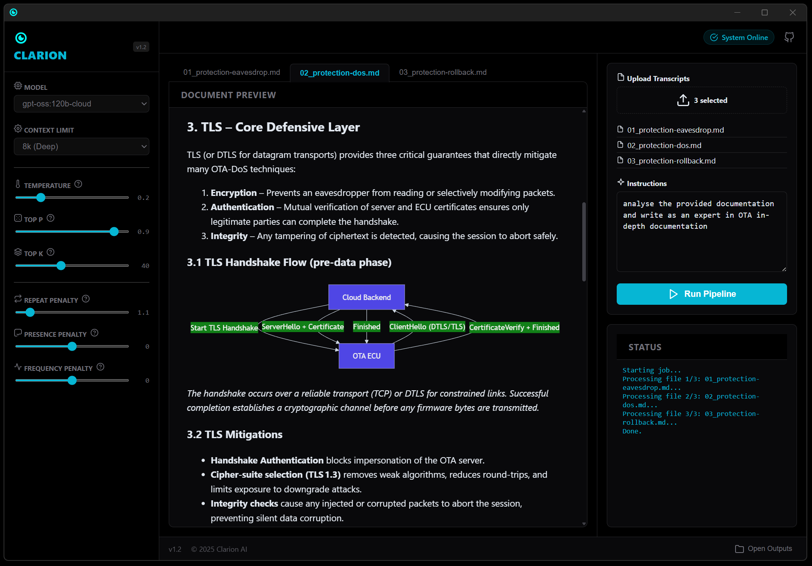

<p align="center">
  <a href="https://github.com/Akshay090/svg-banners">
    
  </a>
</p>

<h3 align="center">Deterministic Scientific and Technical Documentation Generator</h3>

<p align="center">
  
</p>


<h4 align="center">

[](LICENSE)
[](https://www.python.org/)
[](https://python-poetry.org/)
[](https://nodejs.org/)
[](https://www.typescriptlang.org/)
[](https://fastapi.tiangolo.com/)
[](https://tauri.app/)
[](https://ollama.com/)
[](https://mermaid.js.org/)
[](https://www.docker.com/)
[](#)
[](#)
[](https://deepwiki.com/CagriCatik/Clarion)
</h4>

--- 

Clarion is an AI-powered system for converting raw transcripts and unstructured notes into deterministic, high-quality technical documentation. Unlike generic chat-based tools, Clarion enforces structure and correctness through a multi-stage agentic pipeline designed for scientific and engineering use cases.

- **Backend**: Python, FastAPI, Pydantic, httpx
- **Frontend**: TypeScript, React, Vite, Tauri
- **Orchestration**: concurrently or Docker Compose

---

## Demo

Clarion comes with sample inputs to demonstrate its capabilities.

**[Input](inputs/01_protection-eavesdrop.md)**
> A raw, unstructured transcript discussing OTA security mechanisms, including transport security, payload encryption, and hardware modules.

**[Output](outputs/01_protection-eavesdrop_doc.md)**
> A fully structured technical document containing:
> - **Introduction & Principles** (extracted from raw text)
> - **Mermaid Diagrams** (visualizing the key flow)
> - **Technical Specifications** (organized hierarchically)

---

## Core Capabilities

### Deterministic Expert Pipeline

Clarion follows a strict, multi-phase generation process to minimize hallucinations and formatting errors:

1. **Context-Aware Chunking**
   Large inputs are split using a Markdown-aware splitter that preserves semantic boundaries such as headers and paragraphs.
2. **Planning Before Generation**
   Each document is preceded by an explicit planning phase (chain-of-thought style) to define structure and intent before text generation.
3. **Reflection and Self-Correction**
   A post-generation review pass validates formatting, Mermaid syntax, and structural consistency, correcting errors automatically.

This pipeline prioritizes repeatability, traceability, and correctness over stylistic variability.

---

### User Interface

* Split-pane layout with live Markdown preview.
* Enforced professional dark theme.
* Native Mermaid diagram rendering.
* Inline tooltips for advanced LLM parameters such as temperature and top-p.

---

### Configurable Prompt System

* All system prompts are stored as external Jinja2 templates in `src/clarion/prompts`.
* Prompts can be edited without modifying application code.
* Templates are hot-reloaded on each generation via the `PromptLoader`.

This design enables rapid iteration on reasoning strategies and output structure.

---

## Installation

### Prerequisites

* **Ollama**, installed and running locally (`ollama serve`)
* **Recommended models**: `gpt-oss:120b-cloud`, `gpt-oss:20b-cloud`
* **Python 3.11 or newer**, preferably managed with Poetry
* **Node.js 20 or newer** for the frontend

### Setup

```powershell
# Install backend dependencies
poetry install

# Install frontend dependencies
cd gui
npm install
cd ..
```

---

## Running Clarion

### Option A: Unified Development Script (Recommended)

On Windows, a single script is provided:

```powershell
.\dev.bat
```

This launches the FastAPI backend and the React frontend together using `concurrently`.

---

### Option B: Docker

Run the full stack in containers:

```powershell
docker-compose up --build
```

Endpoints:

* Frontend: [http://localhost:1420](http://localhost:1420)
* Backend: [http://localhost:8000](http://localhost:8000)

Note: Containers connect to the host Ollama instance via `host.docker.internal`.

---

### Option C: Manual Startup

**Backend:**

```powershell
poetry run uvicorn clarion.server:app --reload
```

**Frontend:**

```powershell
cd gui
npm run tauri dev
```

## Disclaimer

* Clarion improves consistency and structure by using a multi-stage LLM pipeline, but it does not guarantee factual correctness by itself. 
* Outputs should be treated as high-quality drafts derived from the input, not as an authoritative source of truth. 
* For scientific, security, or safety-critical documentation, results must be reviewed and validated against the original transcript and external references.