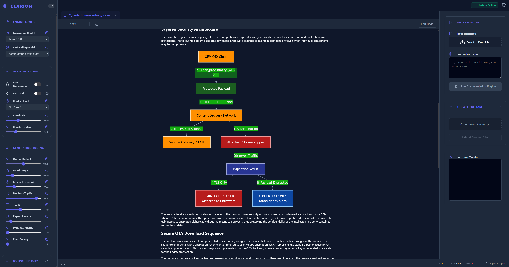
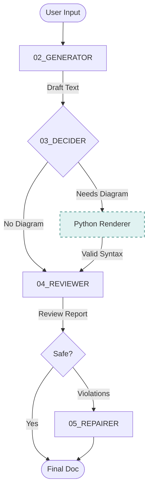

<p align="center">
  <a href="#">
    
  </a>
</p>

<h3 align="center">Epistemic Technical Documentation Engine</h3>

<p align="center">
  Clarion is a local-first, <b>epistemic</b> documentation generator that ensures correctness through a multi-agent control loop (Generator → Reviewer → Repairer). It converts unstructured inputs into strictly validated technical documents.
</p>

<h4 align="center">

[](LICENSE)
[](https://www.python.org/)
[](https://vitejs.dev/)
[](https://fastapi.tiangolo.com/)
[](https://ollama.com/)
[](https://mermaid.js.org/)

</h4>

<p align="center">
  
</p>


---

## What Makes It "Epistemic"?

Traditional LLM tools just "guess" the output. Clarion **knows** if its output is correct because it validates it against a strict set of rules before you ever see it.

It employs a **Robust Epistemic Loop**:

1. **Generator (Creative)**: Drafts the content based on instructions.
2. **Decider (Logic)**: Analyzes if a diagram is needed and outputs a JSON spec (not code).
3. **Renderer (Deterministic)**: A Python engine generates **guaranteed valid** Mermaid syntax from the spec.
4. **Reviewer (Auditor)**: A skeptical auditor checks the result for compliance violations.
5. **Repairer (Fixer)**: A deterministic engine surgically fixes *only* the reported violations.

---

## Demo

Clarion comes with sample inputs to demonstrate its capabilities.

**[Input](inputs/01_protection-eavesdrop.md)**
> A raw, unstructured transcript discussing OTA security mechanisms, including transport security, payload encryption, and hardware modules.

**[Output](outputs/01_protection-eavesdrop_doc.md)**
> A fully structured technical document containing:
> - **Introduction & Principles** (extracted from raw text)
> - **Mermaid Diagrams** (visualizing the key flow)
> - **Technical Specifications** (organized hierarchically)

---

## Key Features

* **Epistemic Reliability**: Self-correcting pipeline that catches syntax errors (like invalid Mermaid graphs) automatically.
* **Local AI Processing**: Fully automated generation using local LLMs via **Ollama** (privacy-first).
* **Structured Output**: Generates strictly formatted Markdown with frontmatter, headers, and tables.
* **Mermaid Diagrams**: Automatically creates flowcharts, sequence diagrams, and process maps.
* **Smart Sanitization**: Backend regex logic instantly fixes common LLM markdown errors.
* **Live Preview**: Real-time Markdown rendering with zoomable Mermaid diagram support.
* **Advanced Controls**: Fine-tune Temperature, Top-P, and Penalties directly from the UI.
* **Structured Output**: Generates strictly formatted Markdown with frontmatter and headers.
* **Live Preview**: Real-time rendering with zoomable diagrams.

---

## Quick Start

### Option A: Docker (Recommended)

Run the entire system (Backend, Frontend, and Ollama with GPU support) in containers.

```powershell
docker-compose up --build
```

* **Frontend**: [http://localhost:5173](http://localhost:5173)
* **Backend**: [http://localhost:8000](http://localhost:8000)
* **Ollama**: Internal + GPU passthrough (Model `llama3.1:8b` or `olmo-3:7b` auto-pulled)

### Option B: Local Windows

1. **Prerequisite**: Install [Ollama](https://ollama.com/) and run `ollama serve`.
2. **Run Script**:
   ```powershell
   .\run_app.bat
   ```

---

## Architecture: The Epistemic Loop

Clarion uses a strict role-based control loop to ensure quality.


```mermaid
graph TD
    classDef role fill:#9cf,stroke:#333,stroke-width:1px;
    classDef logic fill:#ff9,stroke:#333,stroke-width:2px;

    User([User Input]) --> Gen["02_GENERATOR"]
    Gen --> |Draft Text| Dec{"03_DECIDER"}
    Dec --> |"Needs Diagram"| PyRender["Python Renderer"]
    Dec --> |"No Diagram"| Rev
    PyRender --> |"Valid Syntax"| Rev["04_REVIEWER"]
    
    Rev --> |"Review Report"| Check{Safe?}
    Check --> |"Yes"| Out([Final Doc])
    Check --> |"Violations"| Rep["05_REPAIRER"]
    Rep --> Out
    
    style PyRender fill:#e0f2f1,stroke:#00695c,stroke-dasharray: 5 5
```

### Prompt System (`backend/clarion/prompts`)

The prompt system is strictly organized by **Task Roles**:

* `01_system_core.j2`: The **Unified System Prompt** defining global invariants.
* `02_task_generator.j2`: Instructions for Drafting.
* `03_mermaid_decider.j2`: Logic for diagram specification (JSON output).
* `04_task_reviewer.j2`: Instructions for Auditing.
* `05_task_repairer.j2`: Instructions for Fixing.

For a deep dive, see [prompt chaining](docs/PROMPT_CHAINING.md).

---

## API Documentation

Since the backend is built with **FastAPI**, fully interactive API documentation is available:

* **Swagger UI**: [http://localhost:8000/docs](http://localhost:8000/docs)
* **ReDoc**: [http://localhost:8000/redoc](http://localhost:8000/redoc)

The API is organized into Core, Outputs, and System tags for easy navigation.

---

## Configuration

### Changing Models

- You can select different models directly from the UI dropdown. 
- Ensure you have pulled them via Ollama (`ollama pull <model>`).

### Customizing Roles

- Edit the templates in `backend/clarion/prompts/` to change the behavior of specific roles.

## Disclaimer

- Clarion improves consistency and structure by using a multi-stage LLM pipeline, but it does not guarantee factual correctness by itself.
- Outputs should be treated as high-quality drafts derived from the input, not as an authoritative source of truth.
- For scientific, security, or safety-critical documentation, results must be reviewed and validated against the original transcript and external references.
