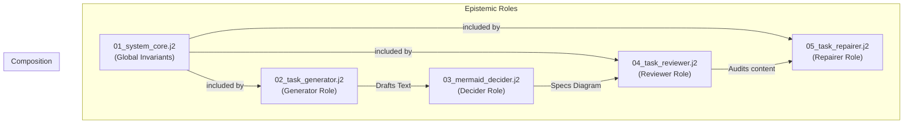
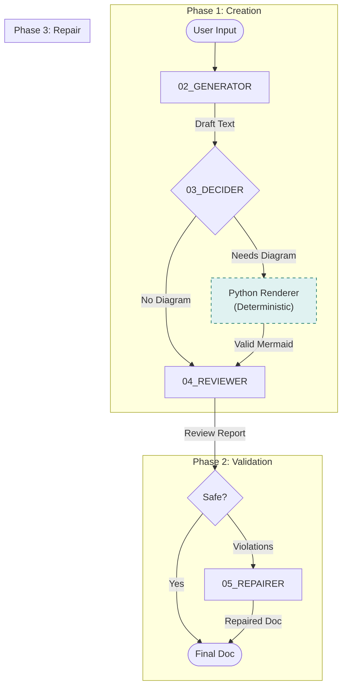

# Clarion Prompt Chaining Architecture

This document explains Clarion's "Epistemic Pipeline," a robust, multi-stage architecture designed to produce high-quality, deterministic technical documentation with guaranteed valid Mermaid diagrams.

---

## 1. Prompt Template Hierarchy

Clarion uses a strictly ordered set of Jinja2 templates. Each template corresponds to a specific "Role" in the epistemic system.

---

## 2. The Epistemic Pipeline

The pipeline processes input through a self-correcting loop that separates *generation* from *logic* and *validation*.

---

## 3. Role Definitions

### 3.1 GENERATOR (`02_task_generator.j2`)
*   **Purpose**: Drafts the initial technical documentation.
*   **Behavior**: Strict adherence to "Input Content Only" (No hallucinations).
*   **Output**: Markdown text (without diagrams).

### 3.2 DECIDER (`03_mermaid_decider.j2`)
*   **Purpose**: Analyzes the drafted text to determine if a visualization is needed.
*   **Behavior**: Outputs a JSON `DiagramSpec` defining nodes and edges, *not* Mermaid code.
*   **Logic**:
    *   If a diagram is needed, the `DiagramSpec` is passed to the **Python Renderer**.
    *   The Python Renderer generates the Mermaid code deterministically, ensuring 100% syntax correctness.

### 3.3 REVIEWER (`04_task_reviewer.j2`)
*   **Purpose**: Audits the complete document (Text + Diagram).
*   **Behavior**: A "Compliance Auditor". Checks for:
    *   Forbidden Mermaid tokens (e.g., `|>` arrow endings).
    *   Writing style violations (e.g., first-person usage).
*   **Output**: A `ReviewReport` (JSON) listing specific errors.

### 3.4 REPAIRER (`05_task_repairer.j2`)
*   **Purpose**: Fixes violations identified by the Reviewer.
*   **Behavior**: "Deterministic Repair Engine".
    *   Fixes *only* the listed errors.
    *   Preserves all other content exactly.
    *   Output: The final, repaired document.

---

## 4. Deterministic Mermaid Generation

Unlike standard LLM chains that ask the model to "write Mermaid code" (often resulting in syntax errors), Clarion uses a **Spec-First** approach.

1.  **LLM (Decider)**: "I need a flowchart. Node A connects to Node B." -> JSON Spec
2.  **Python (Renderer)**: `MermaidRenderer.render(spec)`
    *   Normalizes IDs (alphanumeric only).
    *   Enforces "Declare Nodes First" syntax.
    *   Uses only valid arrow types (`-->`, `-.->`).
3.  **Result**: A mathematically guaranteed valid Mermaid block.

---

## 5. Status Streaming & File Handling

(Standard pipeline behavior for large files and SSE streaming remains consistent with the previous architecture, adjusted for the new step sequence.)

### Large File Handling (Parallel Windows)
When input exceeds the context limit, Clarion splits the text into semantic windows. Each window is processed through the **Generator** step independently. The results are strictly concatenated before the **Decider/Reviewer/Repairer** loop runs on the aggregated draft.

---

## 6. Template File Reference

| File | Role | Purpose | Input Variables |
| :--- | :--- | :--- | :--- |
| `01_system_core.j2` | System | Defines global invariants (e.g., "Role Boundaries"). | None |
| `02_task_generator.j2` | Generator | Drafts text from input. | `instruction`, `context` |
| `03_mermaid_decider.j2` | Decider | Decides if diagram is needed. | `context` (Draft text) |
| `04_task_reviewer.j2` | Reviewer | Audits draft for violations. | `draft_content` |
| `05_task_repairer.j2` | Repairer | Fixes reported violations. | `draft_content`, `errors_json`, `error` |

## Summary

Clarion's **Epistemic Pipeline** replaces simple "prompt engineering" with a rigorous software architecture. By creating distinct roles, enforcing JSON contracts between steps, and offloading syntax generation to deterministic Python code, it achieves a level of reliability impossible with single-shot prompting.
