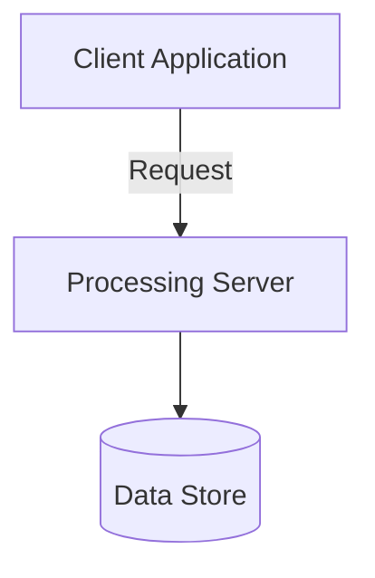

# Technical Documentation

## Overview

This document provides detailed technical specifications for the distributed processing system.

The system uses a client-server model with multiple components interacting through APIs and data streams. The ECU (Engine Control Unit) acts as the central hub, managing communication between various vehicle systems.

## Architecture



## Implementation

The IO Control service is a key component of the system, enabling clients to interact with the ECU through various I/O operations. The service is designed to be flexible and parameterized, allowing for different diagnostic functions.

### Control Functions

Each control function has its own specific data format and requirements, depending on the action to be performed. For example:
*   **Activate/Deactivate Outputs**: Activating or deactivating specific actuators or relays.
*   **Read Sensor Data**: Reading the current value from a sensor.
*   **Set Thresholds**: Configuring thresholds for I/O operations (e.g., setting a temperature threshold).
*   **Test Mode**: Putting a system or component into a test mode to perform diagnostics.
*   **Configure I/O Channel**: Adjusting the configuration of specific I/O channels, such as communication interfaces or sensor input ranges.

### Request/Response Flow

The request/response flow for the IO Control service is as follows:
1.  The client sends a request to the server with the required parameters and control function details.
2.  The server processes the request and performs the specified I/O operation.
3.  The result of the operation is sent back to the client in the response.

```mermaid
graph LR
  participant Client as "Client Application"
  participant Server as "Processing Server"
  note right of Server
  Perform I/O operation
  end
  Client->>Server: Request with parameters and control function details
  Server->>Client: Response with result of I/O operation
```

## Best Practices

To ensure optimal performance and reliability, follow these best practices when using the IO Control service:
*   Use clear and concise parameter names.
*   Specify the correct data format for each control function.
*   Test thoroughly before deploying to production.
*   Monitor system performance and adjust parameters as needed.

---
**Generation Metadata**
- **Model**: llama3.1:8b
- **Time**: 18.28s
- **Vector Context Used**:
  - 01_IO_Control.md (5 chunks)