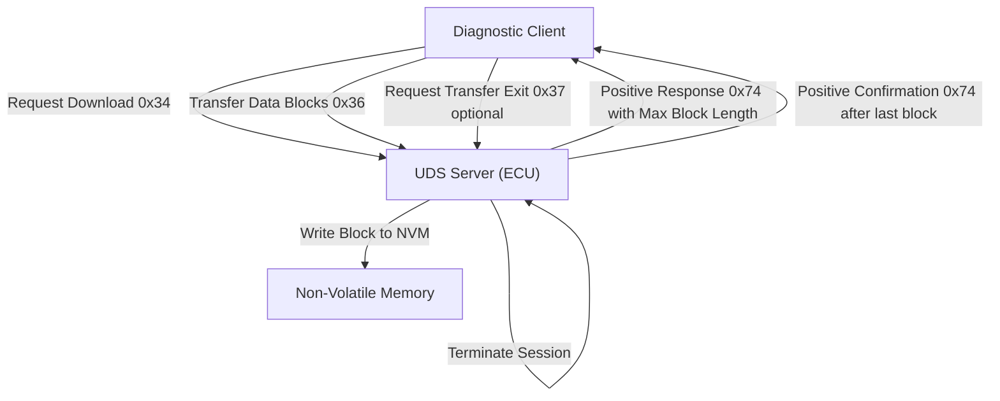

# Unified Diagnostic Services – Request Download (0x34)

## 1. Overview

The Request Download service, identified by the Service Identifier (SID) **0x34**, is a core component of the Unified Diagnostic Services (UDS) protocol defined in ISO 14229. It enables a diagnostic client—such as test equipment or a vehicle‑diagnostic tool—to transfer data to an Electronic Control Unit (ECU). Typical use cases include firmware updates, calibration data uploads, and configuration changes. The service operates at a low level, dealing with raw memory addresses and sizes, and does not rely on a file system. Consequently, it is the preferred mechanism when the ECU does not expose a higher‑level file transfer interface.

## 2. System Architecture

In a UDS‑enabled vehicle, the diagnostic client communicates with the ECU over a communication layer that may be CAN, LIN, FlexRay, or Ethernet. The ECU hosts the UDS server, which parses incoming diagnostic messages, validates parameters, and performs the requested actions. The Request Download service is one of many services offered by the UDS server; it interacts with the ECU’s non‑volatile memory (NVM) subsystem to write incoming data.

The responsibilities of each component are:

- **Diagnostic Client** – Initiates the Request Download, supplies memory address, size, and data format, and streams data blocks.
- **UDS Server (ECU)** – Validates the request, allocates memory, and coordinates the transfer. It also generates positive or negative responses and manages the block‑based data flow.
- **NVM Subsystem** – Receives the data blocks and writes them to the specified memory region. It may perform integrity checks, such as CRC or checksum verification, before committing the data.

The interaction is strictly client‑server; the client never writes directly to the ECU’s memory. All data movement is mediated by the UDS server.

## 3. Request Download Service – Detailed Specification

### 3.1 Request Frame Format

The request frame is a fixed‑length message that conveys the target memory location, the amount of data to be transferred, and optional data‑format information. The frame layout is as follows:

| Byte | Parameter | Description |
|------|-----------|-------------|
| 1 | SID | Service Identifier **0x34** |
| 2 | Data Format Identifier | 1‑byte value specifying compression and encryption. Higher nibble: compression method; lower nibble: encryption method. **0x00** indicates no compression or encryption. |
| 3 | Address and Length Format Identifier | 1‑byte value. Higher nibble: number of bytes used for the Memory Size field. Lower nibble: number of bytes used for the Memory Address field. |
| 4–7 | Memory Address | Starting address in ECU memory where data will be written. 4‑byte value. |
| 8–11 | Memory Size | Size of the data block to be written, in bytes. 4‑byte value. |

The Data Format Identifier allows OEMs to specify proprietary compression or encryption schemes. The Address and Length Format Identifier ensures that the ECU interprets the address and size fields correctly, even if the ECU supports variable‑length fields.

### 3.2 Response Frame Format

After receiving the request, the ECU replies with either a positive or negative response.

#### 3.2.1 Positive Response

The positive response confirms acceptance of the download request and informs the client of the maximum block length it may send in subsequent Transfer Data messages. The frame layout is:

| Byte | Parameter | Description |
|------|-----------|-------------|
| 1 | PCI Length | Length of the response frame. |
| 2 | Response SID | **0x74** (0x34 + 0x40). |
| 3 | Length Format Identifier | 1‑byte value specifying the length of the Max Number of Block Length field. |
| 4 | Max Number of Block Length | 2‑byte field indicating the maximum number of bytes the client can send in each Transfer Data block. |

The Max Number of Block Length is critical for pacing the data transfer; the client must not exceed this value.

#### 3.2.2 Negative Response

If the ECU cannot process the request—due to invalid parameters, memory access violations, or other conditions—it sends a negative response. The frame layout is:

| Byte | Parameter | Description |
|------|-----------|-------------|
| 1 | PCI Length | Length of the response frame. |
| 2 | Request SID | **0x34** |
| 3 | NRC | Negative Response Code indicating the reason for rejection. |

Supported NRCs for Request Download are:

| NRC | Description | Mnemonic |
|-----|-------------|----------|
| 0x13 | Incorrect message length or invalid format | IML |
| 0x22 | Conditions not correct (e.g., invalid parameters) | CNC |
| 0x31 | Request out of range (invalid memory address or size) | ROOR |
| 0x33 | Security access denied | SAD |
| 0x70 | General programming failure | GPF |

The ECU may also return other NRCs defined by ISO 14229, but the above are the most common for this service.

### 3.3 Data Transfer Process

Once the ECU has accepted the request, the client proceeds to stream the data in blocks. The Transfer Data service (SID 0x36) is used for each block. The client must adhere to the Max Number of Block Length specified in the positive response. After all blocks are transmitted, the client may optionally send a Request Transfer Exit (SID 0x37) to terminate the session.

The complete flow is illustrated in the following diagram.

The diagram shows that all data ultimately passes through the UDS server before reaching the NVM subsystem. The ECU performs integrity checks on each block and may reject a block with a negative response if the block is malformed or exceeds the permitted size.

## 4. Lifecycle and State Management

The Request Download service is stateless from the perspective of the UDS server: each request is independent, and the ECU does not retain any state between requests unless a session is explicitly opened. However, the ECU must maintain a temporary buffer for the incoming data until the Transfer Data sequence completes. The buffer is typically allocated in RAM and later committed to NVM.

The ECU’s state machine for this service can be summarized as:

1. **Idle** – Awaiting a diagnostic request.
2. **Download Accepted** – After a positive response, the ECU expects Transfer Data messages.
3. **Programming** – While receiving blocks, the ECU writes to NVM and may perform checksum calculations.
4. **Completed** – Upon receipt of the final block, the ECU sends a final positive response and may reset the ECU or trigger a re‑boot if required.
5. **Error** – If any step fails, the ECU sends a negative response and aborts the download.

The ECU may also enforce session control, requiring the client to open a diagnostic session (SID 0x10) before initiating a download. Session control is outside the scope of this document but is essential for a complete UDS implementation.

## 5. Error Handling and Failure Modes

The Request Download service defines several failure modes, each mapped to a specific NRC. The client must interpret the NRC and take appropriate action:

- **Incorrect Message Length (0x13)** – Verify that the request frame matches the expected length and that all mandatory fields are present.
- **Conditions Not Correct (0x22)** – The ECU may require a specific mode or condition (e.g., a particular diagnostic session). Attempt to satisfy the condition or request a session change.
- **Request Out of Range (0x31)** – Check that the supplied memory address and size are within the ECU’s allowed ranges. OEM documentation typically provides a memory map.
- **Security Access Denied (0x33)** – Perform the security access handshake (SID 0x27) before proceeding with the download.
- **General Programming Failure (0x70)** – Indicates an internal error in the ECU’s programming logic. Retry the download after a suitable delay.

In addition to NRCs, the ECU may abort the transfer if a Transfer Data block fails integrity checks. In such cases, the ECU will send a negative response with an appropriate NRC, and the client must restart the download from the beginning.

## 6. Integration Points and Interfaces

The Request Download service interfaces with several layers of the vehicle’s software stack:

- **UDS Layer** – The service is invoked by the UDS server, which parses the request frame and coordinates with the NVM subsystem.
- **Memory Management Layer** – The ECU’s memory manager validates the target address and size, ensuring that the write does not corrupt critical data.
- **Security Layer** – If the ECU requires security access, the UDS server will invoke the security access service before proceeding with the download.
- **Integrity Layer** – The NVM subsystem may compute checksums or CRCs for each block. The ECU may reject a block if the integrity check fails.

These interfaces are defined by ISO 14229 and are implemented by OEMs according to their specific hardware and software architecture.

## 7. Data Flow and Timing Considerations

The data flow for Request Download is strictly block‑based. The client must monitor the Max Number of Block Length and ensure that each Transfer Data block does not exceed this limit. Timing between blocks is governed by the communication layer’s arbitration and the ECU’s processing speed. In high‑speed networks such as Ethernet, the ECU can accept larger block sizes, whereas in CAN the block size is typically limited to 7 bytes per Transfer Data message.

The ECU’s response includes a PCI Length field that indicates the total size of the response frame. This field allows the client to parse the response correctly, especially when the Length Format Identifier specifies a variable length for the Max Number of Block Length field.

## 8. Failure Handling and Recovery

When a negative response is received, the client must interpret the NRC and decide whether to retry the request, adjust parameters, or abort the operation. For example, a **0x31** NRC indicates that the requested memory region is out of range; the client should verify the memory map and adjust the address or size accordingly.

If a Transfer Data block fails integrity checks, the ECU will send a negative response with an NRC such as **0x70**. The client should then restart the download from the beginning, as partial writes may leave the ECU in an inconsistent state.

In some implementations, the ECU may support a **Request Transfer Exit** (SID 0x37) to gracefully terminate the session. If the client sends this SID after the final block, the ECU acknowledges and resets the temporary buffer. Failure to send this exit request does not prevent the ECU from completing the download, but it may leave the session in an undefined state until the next diagnostic request.

## 9. Best Practices for Implementing Request Download

- **Validate Memory Map** – Reference the ECU’s memory map to ensure that the target address and size are valid.
- **Handle Security Access** – If the ECU requires security access, perform the security handshake before initiating the download.
- **Adhere to Max Block Length** – Do not exceed the block size specified in the positive response; otherwise, the ECU will reject subsequent blocks.
- **Implement Retries** – Network layers may drop frames; implement a retry mechanism for Transfer Data blocks.
- **Verify Integrity** – The ECU may compute a CRC or checksum; provide the data in the format expected by the OEM’s integrity algorithm.
- **Use Request Transfer Exit** – Sending SID 0x37 after the final block ensures that the ECU releases any temporary resources.

These practices are derived from ISO 14229 and common OEM implementations.

## 10. Conclusion

The Request Download service is a fundamental mechanism for transferring data to an ECU in a UDS‑enabled vehicle. Its low‑level nature—addressing raw memory and specifying data size—makes it suitable for firmware updates and calibration uploads where a file system is absent. By strictly following the request and response frame formats, respecting the Max Number of Block Length, and handling NRCs appropriately, a diagnostic client can reliably program an ECU. The flowchart above captures the entire interaction, from request validation to final confirmation, and serves as a reference for developers implementing or testing this service.

---

*This documentation is based solely on the ISO 14229 specification and the provided frame layouts. No assumptions beyond the standard have been made.*

---
**Generation Metadata**
- **Model**: gpt-oss:20b
- **Time**: 908.05s