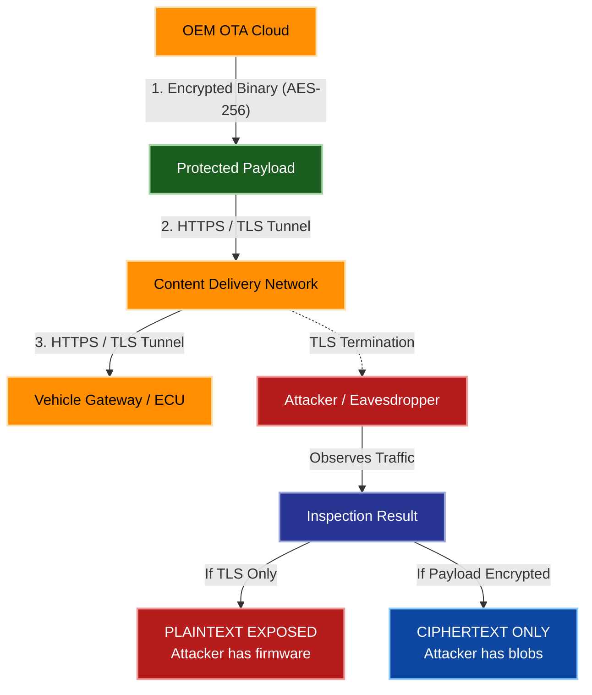
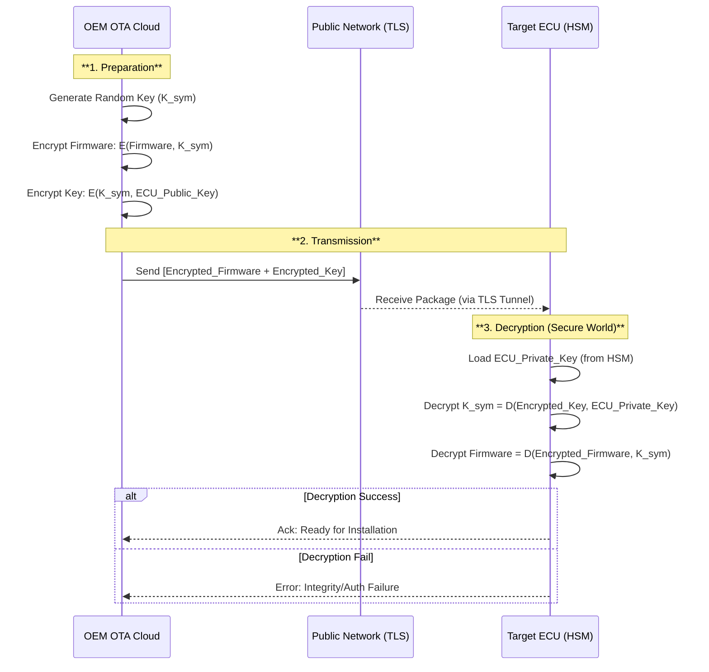

# OTA Security: Protection Against Eavesdropping

## Introduction

Over-the-Air (OTA) update systems represent a critical attack surface in modern connected vehicles, where firmware updates must traverse untrusted public networks before reaching their destination. The confidentiality of update data, including firmware binaries, configuration files, and associated metadata, must be preserved throughout this journey. This document outlines the comprehensive defense strategies required to mitigate eavesdropping attacks, which involve passive interception of data in transit. The protection framework employs a Defense in Depth approach, implementing multiple layers of security controls to ensure that even if one layer is compromised, the confidentiality of the update payload remains intact.

## System Architecture and Threat Model

The OTA update ecosystem consists of multiple components spanning from the OEM backend infrastructure to the target Electronic Control Units (ECUs) within the vehicle. The communication path typically involves the OEM OTA Cloud, potentially intermediate infrastructure such as Content Delivery Networks (CDNs), and finally the vehicle gateway or target ECU. The primary threat addressed in this context is eavesdropping, where an attacker positioned anywhere along this communication path attempts to capture and analyze the transmitted data. The attacker's goal is to extract sensitive information, including intellectual property contained within the firmware, cryptographic keys, or system configuration details that could facilitate further attacks.

## Transport Layer Security Implementation

The first line of defense against eavesdropping attacks is securing the communication channel itself through robust transport layer security. All OTA traffic must be encapsulated within a secure tunnel using TLS 1.2 or preferably TLS 1.3, which provides strong encryption of the entire communication stream. This encryption ensures that any packets intercepted by an eavesdropper remain unreadable without possessing the appropriate decryption keys. The implementation of HTTPS ensures that the client, typically the vehicle's ECU, can authenticate that it is communicating with the legitimate OEM server, preventing redirection attacks that could lead to data exposure.

For enhanced security requirements, particularly in automotive applications subject to standards such as UN R156 and ISO 21434, Mutual TLS (mTLS) should be enforced. This approach requires both the server and the client to present valid x.509 certificates during the TLS handshake, effectively preventing Man-in-the-Middle attacks that could facilitate eavesdropping. The mutual authentication mechanism ensures that not only does the vehicle verify the server's identity, but the server also validates the vehicle's identity, creating a trusted communication channel resistant to impersonation attacks.

## Application Layer Payload Encryption

While TLS provides robust protection for data in transit, relying solely on transport layer security is often insufficient for automotive security requirements. The TLS termination point may be an edge node or CDN, where the content could potentially be exposed in plaintext. To address this vulnerability, application layer encryption must be implemented to provide end-to-end protection of the firmware payload. This approach ensures that the firmware binary itself remains encrypted throughout its entire journey, from the OEM backend through any intermediate infrastructure to the target ECU.

The encryption strategy typically employs a hybrid approach combining symmetric and asymmetric cryptography. Large firmware binaries are encrypted using symmetric algorithms such as AES-256-GCM or ChaCha20-Poly1305, which provide both confidentiality and integrity protection while being computationally efficient for the ECU to decrypt. The symmetric key used for payload encryption is then protected through asymmetric encryption, either by encrypting it with the target ECU's public key or deriving it through a secure key exchange protocol such as Elliptic Curve Diffie-Hellman (ECDH). This envelope encryption pattern allows for efficient bulk data encryption while maintaining secure key distribution.

## Secure Key Storage and Management

The effectiveness of encryption-based protection ultimately depends on the security of the cryptographic keys. Private keys used for decryption must be protected against extraction or compromise through the use of tamper-resistant hardware security modules. These can include dedicated Hardware Security Modules (HSMs), Trusted Platform Modules (TPMs), or Secure Hardware Extensions (SHE) integrated within the ECU. The secure storage environment ensures that even if an attacker gains physical access to the vehicle, the extraction of cryptographic keys remains computationally infeasible.

Key isolation is a critical aspect of the security architecture, where all cryptographic operations, particularly decryption, must occur within the secure hardware environment. This prevents the plaintext firmware or the cryptographic keys from ever appearing in the rich operating system's memory, where they could potentially be extracted through software vulnerabilities. The secure environment acts as a trust boundary, ensuring that sensitive data remains protected throughout the decryption process and is only made available to the secure boot or update installation mechanisms within the trusted execution environment.

## Layered Security Architecture

The protection against eavesdropping relies on a comprehensive layered security approach that combines transport and application layer protections. The following diagram illustrates how these layers work together to maintain confidentiality even when individual components may be compromised.

This architectural approach demonstrates that even if the transport layer security is compromised at an intermediate point such as a CDN where TLS termination occurs, the application layer encryption ensures that the firmware payload remains protected. The attacker would only gain access to encrypted ciphertext without the means to decrypt it, thus preserving the confidentiality of the intellectual property contained within the update.

## Secure OTA Download Sequence

The implementation of secure OTA updates follows a carefully designed sequence that ensures confidentiality throughout the process. The sequence employs a hybrid encryption scheme, often referred to as envelope encryption, which represents the standard best practice for OTA security implementations. This process begins with preparation on the OEM backend, where a random symmetric key is generated specifically for the update transaction.

The preparation phase involves the backend generating a random symmetric key, which is then used to encrypt the firmware payload using the selected symmetric encryption algorithm. This symmetric key is subsequently encrypted using the target ECU's public key, creating an encrypted key package that can only be decrypted by the intended recipient. The complete package, consisting of the encrypted firmware and the encrypted symmetric key, is then transmitted over the secure TLS channel to the vehicle.

Upon reception, the ECU initiates the decryption process within its secure hardware environment. The ECU first loads its private key from the secure storage, which is used to decrypt the symmetric key. Once the symmetric key is recovered, it is then used to decrypt the firmware payload. This entire decryption process occurs within the secure world, ensuring that the plaintext firmware and cryptographic keys never expose themselves to the less secure rich operating system environment.

The sequence diagram illustrates the complete flow from preparation through transmission to secure decryption. The process includes error handling mechanisms where decryption failures result in appropriate error reporting back to the cloud, preventing installation of potentially corrupted or tampered updates. This end-to-end encrypted approach ensures that even if intermediate infrastructure is compromised or if network traffic is intercepted, the confidentiality of the firmware update remains protected.

## Security Recommendations and Implementation Guidelines

The implementation of robust eavesdropping protection requires adherence to specific security standards and best practices across multiple layers of the system architecture. At the transport layer, the implementation of Mutual TLS (mTLS) using TLS 1.3 provides fundamental protection for the communication channel, securing the transmission pipe against man-in-the-middle attacks and passive network sniffing. This layer establishes the foundation for secure communication by ensuring both parties authenticate each other and all traffic is encrypted.

The application layer must implement hybrid encryption combining symmetric algorithms for bulk data encryption with asymmetric cryptography for key protection. The use of AES-256-GCM or ChaCha20-Poly1305 for firmware encryption provides both confidentiality and integrity protection, while RSA or ECC algorithms secure the symmetric key distribution. This dual-layer approach ensures that the data remains protected even if the transport layer security is compromised at intermediate points such as CDNs or edge nodes.

Hardware-based security forms the third critical pillar of the defense strategy. The use of Hardware Security Modules, Trusted Platform Modules, or Secure Hardware Extensions provides tamper-resistant storage for private keys and creates a secure execution environment for cryptographic operations. This hardware-based protection ensures that cryptographic keys cannot be extracted through physical or software-based attacks, maintaining the root of trust for the entire OTA security ecosystem.

The combination of these three layers of security creates a comprehensive defense against eavesdropping attacks, ensuring that firmware updates remain confidential throughout their lifecycle from the OEM backend to installation on the target ECU. This multi-layered approach addresses the requirements of automotive security standards while providing practical protection against real-world attack scenarios that threaten the integrity and confidentiality of OTA update systems.