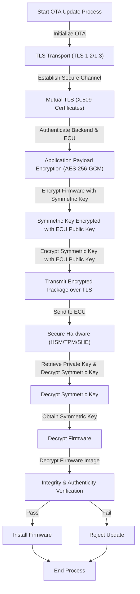

# OTA Eavesdropping Protection – Defense in Depth

## 1. Overview
The goal is to preserve confidentiality of firmware, configuration files, and update metadata from the OEM backend to the vehicle even when the communication traverses public or untrusted networks (cellular, Wi‑Fi). An eavesdropper can only observe encrypted blobs; no plaintext firmware or secrets are ever exposed.

## 2. Layered Security Model
### 2.1 Transport Security (TLS)
- All OTA traffic uses **TLS 1.2** or **TLS 1.3**.
- TLS provides:
  - Encryption of the entire channel.
  - Server authentication via X.509 certificates.
- **Mutual TLS** (mTLS) is recommended: both backend and ECU present certificates, preventing MITM and limiting passive monitoring.

### 2.2 Application‑Layer Payload Encryption
- TLS termination may occur at edge nodes or CDNs (per UN R156, ISO 21434), leaving plaintext vulnerable.
- Firmware is encrypted **before** entering the distribution network using a symmetric cipher such as **AES‑256‑GCM** or **ChaCha20‑Poly1305**.
- The symmetric key is never sent in clear; it is encrypted with the ECU’s public key or derived via **ECDH**.
- Result: even if the TLS tunnel is terminated, the payload remains confidential.

### 2.3 Secure Key Storage & Decryption
- Private keys reside inside tamper‑resistant hardware:
  - **HSM**, **TPM**, or **SHE** modules.
  - Decryption of the symmetric key and the firmware happens inside this secure enclave.
- Plaintext firmware never touches the main OS memory, thwarting extraction attempts.

## 3. End‑to‑End OTA Flow
The following diagram illustrates the complete protected OTA update sequence.

### 3.1 Detailed Step Description
1. **Backend** generates a random symmetric key and encrypts the firmware image.
2. The symmetric key is encrypted with the target ECU’s public key (or via ECDH).
3. Both encrypted blobs are sent over a **TLS‑protected** channel (optionally mTLS).
4. The ECU receives the package and, within its **secure hardware**, uses the stored private key to recover the symmetric key.
5. The firmware is decrypted, authenticated, and, if valid, the ECU signals readiness for installation.
6. Any verification failure aborts the update, ensuring that malformed or tampered data never reaches the vehicle.

## 4. Security Guarantees
- **Confidentiality**: Data is encrypted at transport and payload layers.
- **Integrity & Authenticity**: TLS and AEAD ciphers provide tamper detection; hardware verification adds an extra layer.
- **Key Protection**: Private keys never leave the secure element, mitigating extraction attacks.
- **Resilience to TLS Termination**: Even if the TLS tunnel ends at an edge node, the payload remains encrypted.

---
*References*: UN R156, ISO 21434, TLS 1.2/1.3 specifications, NIST SP 800‑38D (AES‑GCM), NIST SP 800‑185 (ChaCha20‑Poly1305).