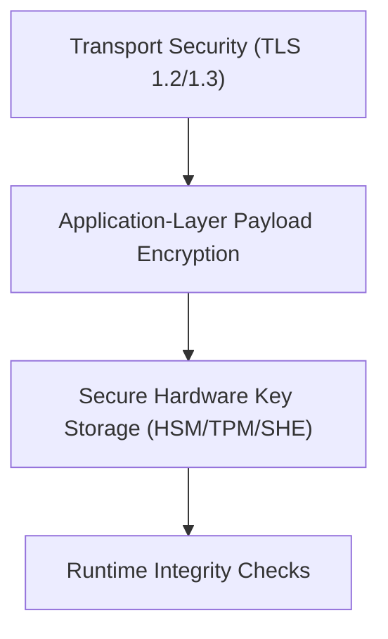
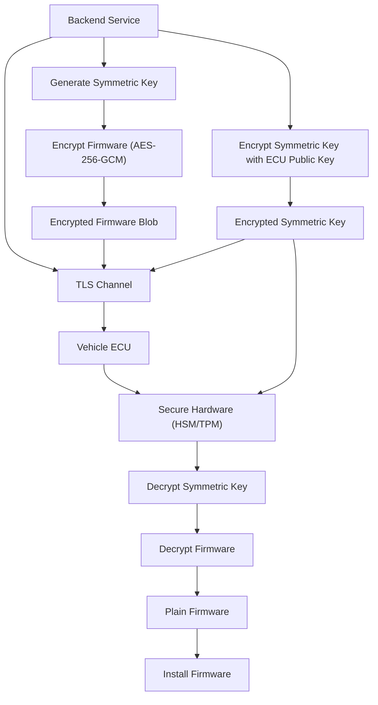

# OTA Update Protection Against Eavesdropping Attacks

## 1. Overview
Over‑the‑air (OTA) updates deliver new firmware, configuration files, and metadata to vehicles after they leave the factory. Because these updates travel over public or untrusted networks (cellular, Wi‑Fi, etc.), an eavesdropper can capture the traffic. The goal of the protection strategy is **confidentiality**: an attacker must never obtain usable firmware or cryptographic secrets, even if they can see every packet on the wire.

## 2. Threat Model
- **Passive interception**: attacker records all network traffic between the OEM backend and the vehicle.
- **TLS termination**: intermediate nodes (CDNs, edge gateways) may terminate TLS, exposing plaintext beyond the TLS tunnel.
- **Physical access to vehicle**: attacker may attempt to extract keys from the ECU.

## 3. Defense‑in‑Depth Layers
| Layer | Primary Goal | Typical Mechanisms |
|------|--------------|--------------------|
| **1. Transport Security** | Protect data while in transit | TLS 1.2 / TLS 1.3, optional mutual TLS |
| **2. Application‑Layer Payload Encryption** | Protect payload even if TLS is terminated | AES‑256‑GCM or ChaCha20‑Poly1305, asymmetric key wrap (ECDH / RSA) |
| **3. Secure Key Storage** | Prevent key extraction on the vehicle | HSM, TPM, Secure Hardware Extension (SHE) |
| **4. Runtime Integrity Checks** | Detect tampering after decryption | Signature verification, hash checks |

### 3.1 Layer Diagram

## 4. Transport Security (TLS)
- **Encryption**: TLS encrypts the entire channel, preventing packet‑level readability.
- **Authentication**: Server certificate validates the backend; mutual TLS adds client‑certificate verification, mitigating man‑in‑the‑middle attacks.
- **Algorithm selection**: TLS 1.3 mandates AEAD ciphers (e.g., AES‑256‑GCM, ChaCha20‑Poly1305) providing confidentiality and integrity.
- **Limitations**: Standards (UN R156, ISO 21434) acknowledge that TLS may be terminated at edge nodes, so payload must remain encrypted beyond the TLS tunnel.

## 5. Application‑Layer Payload Encryption
1. **Generate a random symmetric key** (`K_sym`).
2. **Encrypt the firmware image** with `K_sym` using an AEAD cipher (AES‑256‑GCM or ChaCha20‑Poly1305). The output is an *encrypted firmware blob* plus an authentication tag.
3. **Wrap `K_sym`** with the target ECU’s public key (RSA‑OAEP, ECIES) or derive it via an ECDH exchange. The result is an *encrypted symmetric key*.
4. **Transmit** both encrypted artifacts over the TLS channel.

### 5.1 Payload Encryption Diagram

## 6. Secure Key Storage on the Vehicle
- **Hardware security modules (HSM)**, **Trusted Platform Modules (TPM)**, or **Secure Hardware Extensions (SHE)** store the ECU private key.
- **Operations inside the secure enclave**: Decryption of the wrapped symmetric key and the AEAD verification happen inside the hardware, ensuring the private key and plaintext never appear in the main OS memory.
- **Resistance to attacks**: These modules are designed to thwart side‑channel, fault injection, and invasive probing attempts.

## 7. End‑to‑End OTA Flow
1. Backend creates `K_sym` and encrypts the firmware.
2. Backend encrypts `K_sym` with the ECU’s public key.
3. Both encrypted blobs are sent over TLS.
4. ECU receives the package, forwards the encrypted key to its secure hardware.
5. Secure hardware decrypts `K_sym`.
6. ECU uses `K_sym` to decrypt and authenticate the firmware.
7. If verification succeeds, the ECU signals readiness and proceeds with installation; otherwise, the update is rejected.

## 8. Security Guarantees
- **Confidentiality**: All data in transit is encrypted by TLS; the payload remains encrypted even if TLS is terminated.
- **Integrity & Authenticity**: AEAD ciphers provide tamper detection; mutual TLS authenticates the server and optionally the client.
- **Key Protection**: Private keys never leave secure hardware, mitigating extraction attacks.
- **Resilience to Passive Attacks**: An eavesdropper can only capture ciphertext and authentication tags, which are useless without the protected keys.

## 9. References
- **UN Regulation No. 156** – Cybersecurity and Software Updates.
- **ISO/SAE 21434** – Road Vehicles – Cybersecurity Engineering.
- **TLS 1.3 RFC 8446** – The Transport Layer Security (TLS) Protocol Version 1.3.
- **NIST SP 800‑38D** – Recommendation for Block Cipher Modes of Operation: Galois/Counter Mode (GCM).
- **NIST SP 800‑56A Rev. 3** – Key‑Establishment Mechanisms.