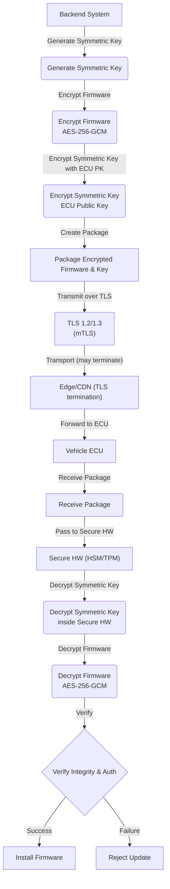

# OTA Update Confidentiality – Defense Against Eavesdropping

---

## 1. Threat Model
- **Eavesdropping** – Passive interception of OTA traffic over public or untrusted networks (cellular, Wi‑Fi, roadside units).  
- Goal of the attacker: obtain usable firmware, configuration files, or update metadata.
- Assumptions:
  - Network can be monitored end‑to‑end.
  - TLS termination may occur at edge nodes or CDNs.
  - Physical access to the vehicle is out of scope for this document (covered by separate key‑extraction mitigations).

---

## 2. Defense‑in‑Depth Strategy
| Layer | Primary Mechanism | Why It’s Needed |
|------|-------------------|-----------------|
| **Transport Security** | TLS 1.2 / TLS 1.3 (optionally mutual TLS) | Encrypts the channel, authenticates the backend, prevents plain‑text sniffing. |
| **Application‑Layer Payload Encryption** | Symmetric encryption (AES‑256‑GCM or ChaCha20‑Poly1305) + asymmetric key wrap (ECU public key or ECDH) | Guarantees confidentiality even if TLS is terminated or inspected downstream. |
| **Secure Key Protection on Vehicle** | Secure hardware (HSM, TPM, SHE) storing ECU private key; decryption performed inside the secure enclave | Prevents extraction of private keys and plaintext firmware from the main OS memory. |

---

## 3. Transport Security (TLS / mTLS)
- **TLS 1.2 / 1.3** provides confidentiality, integrity, and server authentication.
- **Mutual TLS** adds client authentication: the ECU presents an X.509 certificate, the backend validates it, and vice‑versa. This blocks man‑in‑the‑middle (MITM) attacks and limits passive monitoring.
- **TLS termination** may happen at edge nodes or CDNs for performance; therefore, TLS alone is not sufficient for automotive‑grade confidentiality.

---

## 4. Application‑Layer Payload Encryption
1. **Symmetric Key Generation** – Backend creates a fresh 256‑bit key per update.
2. **Firmware Encryption** – Firmware image is encrypted with AES‑256‑GCM (or ChaCha20‑Poly1305) providing confidentiality and an authentication tag.
3. **Key Wrapping** – The symmetric key is encrypted with the target ECU’s public key (RSA‑OAEP, ECIES) or derived via an ECDH exchange.
4. **Packaging** – Encrypted firmware + encrypted symmetric key are bundled together and sent over the TLS channel.

---

## 5. Secure Key Storage on the Vehicle
- Private keys reside in a **Hardware Security Module (HSM)**, **Trusted Platform Module (TPM)**, or **Secure Hardware Extension (SHE)**.
- Decryption of the wrapped symmetric key occurs **inside** the secure enclave; the plaintext key never leaves the protected boundary.
- The ECU’s secure boot chain validates the integrity of the decryption firmware before any plaintext is processed.

---

## 6. End‑to‑End OTA Flow

---

## 7. Standards & Compliance
- **UN R156** – Requires confidentiality of OTA payloads even when TLS termination occurs.
- **ISO/SAE 21434** – Mandates layered cryptographic protection and secure key storage for automotive cybersecurity.
- **SAE J3061** – Recommends mutual authentication and end‑to‑end encryption for OTA services.

---

## 8. Best‑Practice Checklist
- ✅ Use TLS 1.3 wherever possible; fallback to TLS 1.2 with strong cipher suites.
- ✅ Deploy mutual TLS for all vehicle‑to‑backend connections.
- ✅ Encrypt firmware with AEAD ciphers (AES‑GCM, ChaCha20‑Poly1305).
- ✅ Wrap symmetric keys with ECU‑specific public keys; rotate keys per update.
- ✅ Store ECU private keys in tamper‑resistant hardware; never expose them to the OS.
- ✅ Verify both the AEAD tag and a signed manifest before installation.
- ✅ Log and audit every OTA transaction for forensic analysis.
- ✅ Perform regular penetration testing of the OTA pipeline, including TLS termination points.

---

## 9. Conclusion
By combining **transport‑level TLS/mTLS**, **application‑layer payload encryption**, and **secure hardware key protection**, an OTA system achieves robust confidentiality against passive eavesdropping. Even if an attacker intercepts traffic or gains access to intermediate network nodes, they only ever see encrypted blobs that cannot be decrypted without the ECU‑specific private key stored in a hardened enclave. This layered approach satisfies automotive security standards and provides a strong defense‑in‑depth posture for over‑the‑air updates.