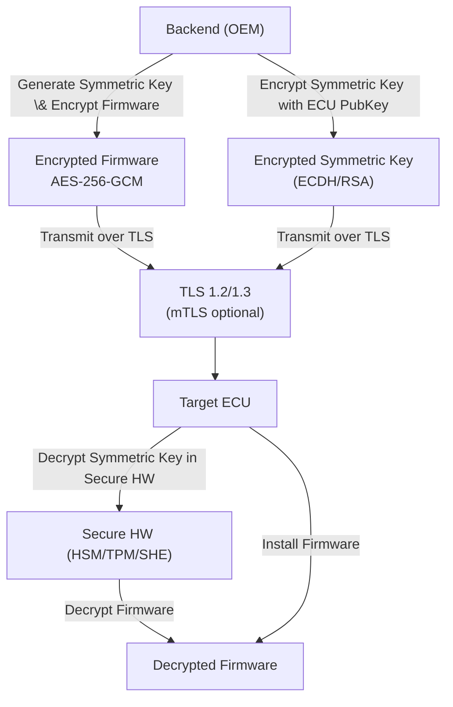

# OTA Update Security – Defending Against Eavesdropping

## 1. Introduction
Eavesdropping attacks involve passive interception of data traversing public or untrusted networks (cellular, Wi‑Fi, etc.). In the automotive domain, the confidentiality of **firmware**, **configuration files**, and **metadata** must be preserved from the OEM backend all the way to the vehicle.  A layered, defense‑in‑depth strategy is employed so that the compromise of any single layer does **not** expose clear‑text assets.

---

## 2. Defense‑in‑Depth Layers
| Layer | Primary Goal | Typical Mechanisms |
|-------|--------------|--------------------|
| **Transport Security** | Hide all traffic on the wire | TLS 1.2 / TLS 1.3, HTTPS, Mutual TLS (mTLS) |
| **Application‑Layer Payload Encryption** | Protect the payload even if TLS is terminated | AES‑256‑GCM / ChaCha20‑Poly1305, asymmetric key wrapping (RSA‑OAEP, ECIES) |
| **Secure Key Storage & Execution** | Prevent extraction of private keys / plaintext firmware | HSM, TPM, Secure Hardware Extension (SHE), isolated execution environments |

---

## 3. Transport Security (TLS / mTLS)
* **TLS 1.2 or TLS 1.3** encrypts the entire channel, providing confidentiality and integrity.
* **Server authentication** via X.509 certificates guarantees the vehicle talks to the legitimate backend.
* **Mutual TLS** adds ECU‑side certificates, thwarting man‑in‑the‑middle (MITM) attacks and limiting passive sniffing to encrypted blobs.
* Standards such as **UN R156** and **ISO 21434** acknowledge that TLS termination may occur at edge nodes or CDNs; therefore TLS alone is **not** sufficient for automotive‑grade confidentiality.

---

## 4. Application‑Layer Payload Encryption
1. **Generate a random symmetric key** (Ksym) per OTA package.
2. **Encrypt the firmware image** with an AEAD cipher (AES‑256‑GCM or ChaCha20‑Poly1305). The resulting ciphertext includes an authentication tag, ensuring integrity.
3. **Wrap the symmetric key** using the target ECU’s public key (RSA‑OAEP, ECIES, or ECDH‑derived key). Only the ECU can recover Ksym.
4. **Transmit both encrypted artifacts** (ciphertext + wrapped key) over the TLS channel.

> **Why AEAD?** Authenticated Encryption with Associated Data (AEAD) provides confidentiality **and** tamper detection in a single operation, which is essential for OTA safety.

---

## 5. Secure Hardware Key Protection on the Vehicle
* **Private keys** never leave the secure element (HSM/TPM/SHE). The ECU invokes a *decrypt* operation inside the hardware, receiving only the plaintext symmetric key inside the protected boundary.
* **Secure boot** and **trusted execution environments (TEE)** ensure that the decrypted firmware is handed off directly to the bootloader without ever residing in the main OS memory.
* **Physical tamper resistance** (mesh sensors, epoxy, voltage/temperature monitoring) raises the bar for attackers attempting side‑channel extraction.

---

## 6. End‑to‑End OTA Flow (Illustrated)

### Flow Explanation
1. **Backend** creates Ksym, encrypts the firmware, and wraps Ksym.
2. Both ciphertext and wrapped key travel **inside** a TLS tunnel (optionally protected by mTLS).
3. **ECU** receives the blobs, forwards the wrapped key to its **SecureHW**.
4. **SecureHW** performs the private‑key operation, yielding Ksym, which is then used to decrypt the firmware.
5. If decryption and AEAD authentication succeed, the ECU signals readiness and proceeds with installation.

---

## 7. Security Guarantees Against Eavesdropping
| Attack Vector | Mitigation Provided |
|--------------|---------------------|
| Passive packet capture on the network | TLS encrypts the transport; even if TLS is terminated, payload remains encrypted with AES‑256‑GCM/ChaCha20‑Poly1305. |
| Compromise of edge/CDN nodes | Application‑layer encryption ensures the firmware never appears in clear text beyond the backend. |
| Extraction of symmetric key from traffic | The symmetric key is wrapped with the ECU’s public key; without the private key (stored in secure hardware) it is useless. |
| Side‑channel extraction of private key | Keys reside in tamper‑resistant hardware; decryption occurs inside the secure boundary, never exposing the key to the OS. |

---

## 8. References & Standards
* **UN Regulation No. 156** – Cybersecurity and software updates for vehicles.
* **ISO/SAE 21434** – Road vehicles – Cybersecurity engineering.
* **RFC 8446** – TLS 1.3.
* **NIST SP 800‑38D** – Recommendation for Block Cipher Modes of Operation: GCM.
* **NIST SP 800‑56C Rev. 2** – Key‑establishment schemes based on elliptic curve cryptography.

---

*End of document.*