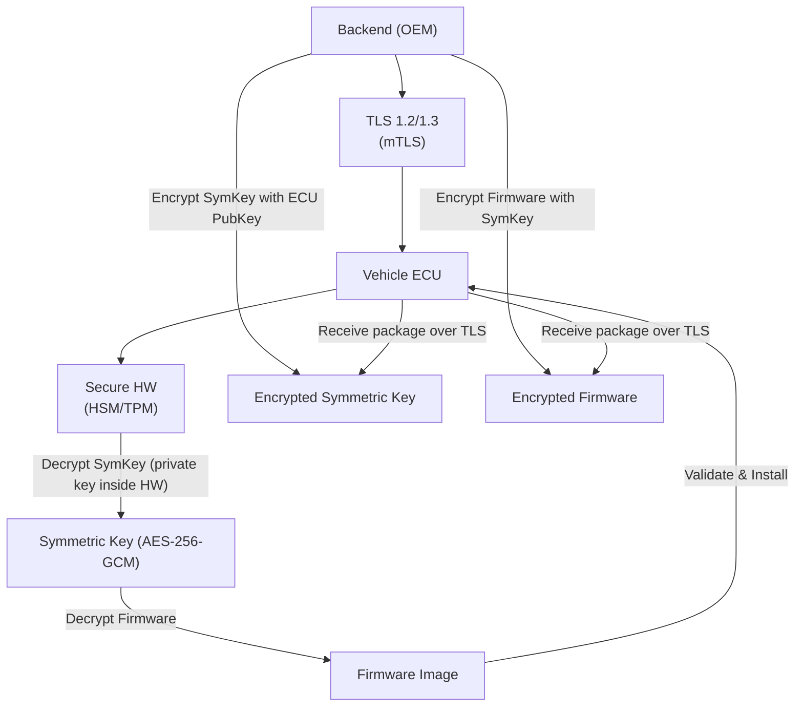

# OTA Update Confidentiality – Defense in Depth

## Overview
An over‑the‑air (OTA) update must remain confidential from the OEM backend all the way to the vehicle ECU.  Eavesdropping attacks are passive: an adversary can capture packets on cellular, Wi‑Fi, or any untrusted network, but cannot modify them.  To thwart such attacks we employ **multiple, complementary layers**:

1. **Transport security (TLS 1.2/1.3, optionally mutual TLS).**
2. **Application‑layer payload encryption (AES‑256‑GCM or ChaCha20‑Poly1305).**
3. **Secure hardware key protection on the vehicle (HSM/TPM/SHE).**

If any single layer is compromised, the remaining layers still protect the firmware and keys.

---

## 1. Transport Security (TLS)
- All OTA traffic travels over **HTTPS** using TLS 1.2 or TLS 1.3.
- The server presents an X.509 certificate, authenticating the backend.
- **Mutual TLS** can be enabled so the ECU also presents a certificate, preventing man‑in‑the‑middle attacks and ensuring the vehicle talks to the legitimate backend.
- TLS encrypts the whole channel, so a passive observer only sees ciphertext blobs.

> **Note:** Standards such as **UN R156** and **ISO 21434** assume TLS may be terminated at edge nodes or CDNs, so we cannot rely on TLS alone for confidentiality.

---

## 2. Application‑Layer Payload Encryption
1. The backend generates a **random symmetric key**.
2. Firmware (or configuration files) is encrypted with this key using an **AEAD cipher** (AES‑256‑GCM or ChaCha20‑Poly1305) to provide confidentiality *and* integrity.
3. The symmetric key is never sent in clear. It is wrapped with the target ECU’s **public key** (e.g., RSA‑OAEP or ECIES) or derived via an **ECDH** key‑exchange.
4. Both the **encrypted firmware** and the **encrypted symmetric key** are sent over the TLS channel.

Even if TLS is terminated, the payload remains encrypted and unusable without the ECU’s private key.

---

## 3. Secure Hardware Key Protection on the Vehicle
- The ECU’s **private key** resides inside a tamper‑resistant module (HSM, TPM, or Secure Hardware Extension).
- Decryption of the wrapped symmetric key occurs **inside** this secure environment; the private key never leaves the hardware.
- The symmetric key is then used to decrypt the firmware **inside** the same protected area, ensuring that plaintext firmware never appears in the main OS memory.
- If any decryption or integrity check fails, the update is rejected.

---

## End‑to‑End Flow
1. **Backend** creates a symmetric key and encrypts the firmware.
2. The symmetric key is wrapped with the ECU’s public key.
3. Both encrypted artifacts travel over a **TLS** tunnel to the vehicle.
4. The ECU receives the package, forwards the wrapped key to its **secure hardware**.
5. Secure hardware unwraps the symmetric key, then decrypts the firmware.
6. Upon successful verification, the ECU signals readiness for installation.

The diagram below visualises this layered process.

---

## Key Takeaways
- **TLS** protects the communication pipe, but we assume it can be terminated.
- **Application‑layer encryption** guarantees that the firmware remains confidential even after TLS termination.
- **Secure hardware** ensures that private keys and plaintext firmware never leave a protected environment, thwarting extraction attacks.
- The combination of these layers provides **defense‑in‑depth**, making eavesdropping ineffective against OTA updates.