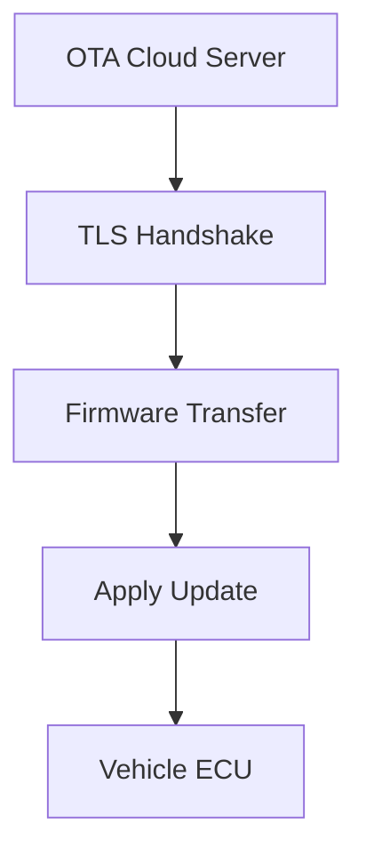
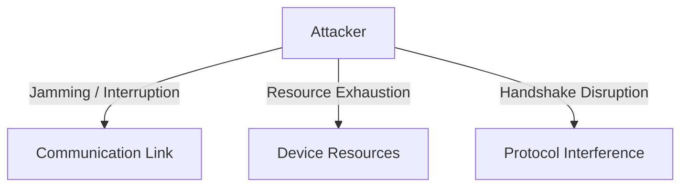
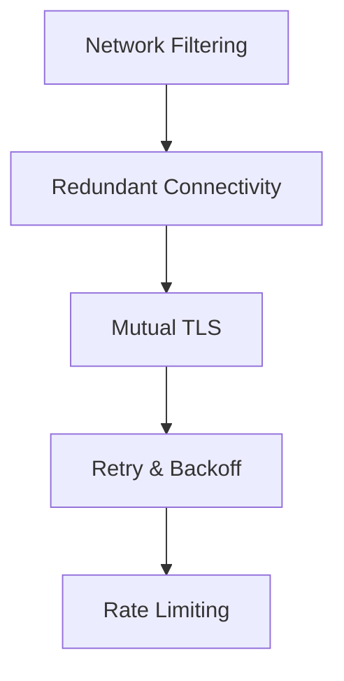

# OTA Denial‑of‑Service (DoS) Protection Guide

## 1. Overview
A denial‑of‑service attack on an OTA (Over‑the‑Air) system aims to **prevent a firmware update from being delivered or applied** on the target ECU. The attacker does **not** need to read or modify the firmware; simply blocking or disrupting the update flow is sufficient. This can lead to missed security patches, degraded vehicle functionality, and reduced reliability.

---

## 2. OTA Update Flow (with TLS)

*The OTA pipeline starts with the cloud server, negotiates a TLS session, transfers the firmware, and finally applies the update on the ECU.*

---

## 3. DoS Attack Vectors in OTA Pipelines

| Vector | Description |
|--------|-------------|
| **Communication Link** | Jamming, selective packet dropping, or flooding the network path between cloud and ECU. |
| **Device Resources** | Exhausting CPU, memory, or storage on the ECU (e.g., by forcing repeated handshakes). |
| **Protocol Interference** | Tampering with TLS handshake messages, terminating sessions, or sending malformed packets. |

---

## 4. TLS – Core Defensive Mechanism
### 4.1 What TLS Provides
1. **Confidentiality** – Encrypted payload prevents an eavesdropper from reading or selectively modifying packets.
2. **Integrity** – MACs / AEAD tags detect any in‑flight alteration, causing the session to abort.
3. **Authentication** – Mutual authentication (mTLS) verifies both server and ECU identities, blocking impersonation.

### 4.2 How TLS Mitigates DoS
- **Protocol‑level attacks** (e.g., handshake manipulation, replay) are detected and cause a safe failure.
- **Man‑in‑the‑middle attempts** are thwarted because the attacker cannot forge valid certificates or MACs.

### 4.3 TLS Limitations
- **Volumetric flooding** (bandwidth saturation) is outside TLS’s scope.
- **Resource‑exhaustion attacks** on the TLS stack (e.g., many half‑open connections) still require additional controls.

---

## 5. Layered Mitigation Architecture

### 5.1 Network‑Level Defenses
- **Traffic filtering & ACLs** to drop malformed or suspicious packets early.
- **Rate limiting** on inbound connections to the OTA backend.
- **DDoS scrubbing services** for large‑scale attacks.

### 5.2 Architectural Resilience
- **Redundant communication paths** (cellular, Wi‑Fi, satellite) with automatic fail‑over.
- **Exponential backoff & jitter** on client retries to avoid thundering‑herd effects.
- **Health monitoring** on the ECU to detect stalled sessions and abort gracefully.

### 5.3 Cryptographic Best Practices
- Use **TLS 1.3** exclusively – reduced handshake round‑trips, forward secrecy, and removal of weak ciphers.
- Deploy **mutual authentication** (client certificates) to prevent rogue devices from consuming server resources.
- Rotate certificates regularly and enforce **OCSP/CRL** checks.

---

## 6. Operational Recommendations
| Recommendation | Rationale |
|----------------|-----------|
| Enforce TLS 1.3 with **AEAD** suites (e.g., TLS_AES_128_GCM_SHA256). | Provides strongest confidentiality & integrity with minimal handshake overhead. |
| Implement **client‑certificate revocation** checks. | Stops compromised ECUs from accessing the OTA service. |
| Use **dual‑SIM or multi‑radio** modules for automatic path switching. | Mitigates single‑link jamming or carrier‑level outages. |
| Apply **connection‑level rate limits** per device identity. | Prevents a compromised ECU from exhausting backend resources. |
| Log and **alert on repeated handshake failures** exceeding a threshold. | Early detection of targeted DoS attempts. |

---

## 7. Summary
- **TLS** secures the OTA channel against protocol‑level manipulation, providing confidentiality, integrity, and mutual authentication.
- **TLS alone does not stop high‑volume flooding or resource‑exhaustion attacks.**
- A **defense‑in‑depth** approach—combining modern TLS deployment, network‑level filtering, redundant connectivity, and robust client‑side retry/back‑off logic—ensures OTA availability even under adversarial conditions.
- Following the outlined best practices yields a resilient OTA pipeline capable of delivering critical updates reliably in connected vehicles and embedded devices.