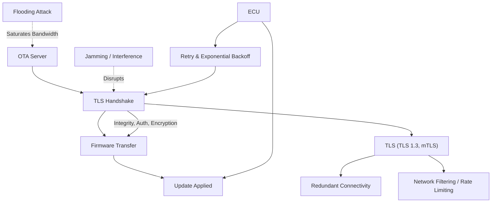

# Denial‑of‑Service Protection in OTA Update Pipelines

## Overview
A denial‑of-service (DoS) attack on an OTA system aims to **prevent a firmware update from being delivered or applied** on the target ECU. The attacker does not need to read or modify the firmware; simply blocking timely delivery is sufficient. This can lead to delayed security patches, reduced reliability, and increased risk in connected vehicles.

## Typical Attack Vectors
| Vector | Description |
|--------|-------------|
| **Communication Interference** | Jamming or selective packet dropping between the cloud backend and the device. |
| **Resource Exhaustion** | Flooding the server or device with high‑volume traffic, causing sessions to stall or be dropped. |
| **Protocol Interference** | Disrupting TLS handshake messages or terminating sessions deliberately. |

## Role of TLS
TLS provides three core protections that directly mitigate protocol‑level DoS attempts:
1. **Encryption** – prevents an adversary from reading or selectively modifying intercepted packets.
2. **Authentication** – mutual TLS (mTLS) verifies both server and ECU identities, blocking impersonation.
3. **Integrity** – any tampering of data triggers a session failure, stopping corrupted updates.

TLS is typically used over **TCP** or **DTLS** (for constrained environments) and negotiates session keys before any firmware payload is transmitted.

## Limitations of TLS
While TLS thwarts **application‑level** disruptions, it **does not stop volumetric attacks** that flood the network or exhaust processing resources. Those require additional network‑level controls.

## Architectural & Network‑Level Defenses
- **Modern TLS versions** (TLS 1.3) – remove insecure algorithms and streamline the handshake.
- **Mutual authentication** – ensures only authorized ECUs can consume backend resources.
- **Redundant connectivity** – switch between cellular, Wi‑Fi, or satellite links.
- **Client‑side health monitoring** – retry limits, exponential backoff, and watchdog timers.
- **Network filtering & rate limiting** – traffic shaping, congestion management, and capacity provisioning.

## Summary
Protecting OTA updates from DoS attacks requires a **multi‑layered approach**:
- TLS secures the channel against protocol manipulation.
- Architectural best practices (redundancy, backoff, mTLS) increase resilience.
- Network‑level controls mitigate large‑scale flooding.
Together, these measures keep OTA pipelines available and reliable even under adversarial conditions.

---

