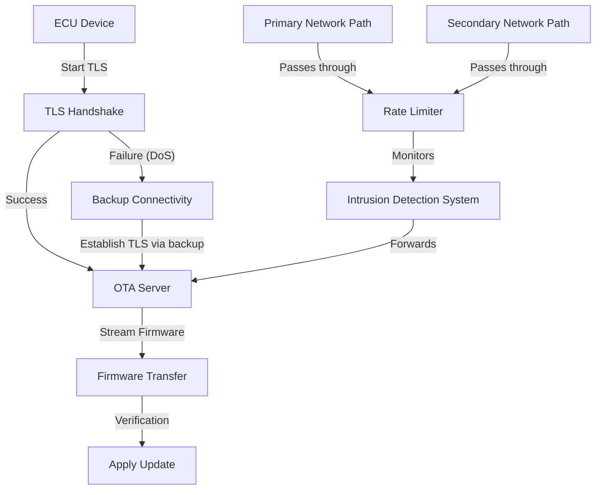

# OTA Denial‑of‑Service (DoS) Protection – In‑Depth Guide

---

## 1. Introduction
A denial‑of‑service attack on an OTA (Over‑the‑Air) system aims to **prevent a firmware image from being delivered or applied** on the target ECU.  The attacker does **not** need to read or modify the firmware; merely blocking or corrupting the update flow is enough to delay security patches, reduce vehicle reliability, and increase exposure to other threats.

---

## 2. Threat Model
| Attack Vector | Description | Potential Impact |
|----------------|-------------|------------------|
| **Network Jamming / Interference** | Radio‑frequency or selective packet loss on the path between cloud and ECU. | Update stalls, timeout, possible rollback. |
| **Resource Exhaustion** | Flooding the OTA server or the ECU with bogus TLS handshakes, connection attempts, or malformed packets. | CPU/memory starvation, denial of new sessions. |
| **Protocol Interference** | Dropping or tampering with TLS handshake messages, terminating sessions early. | Session abort, repeated retries, increased power consumption. |
| **Volumetric Flooding** | Saturating bandwidth on cellular/Wi‑Fi links. | Complete outage of OTA service for all devices. |

---

## 3. TLS – Core Defensive Layer
TLS provides three critical guarantees that directly mitigate **protocol‑level** DoS attempts:

1. **Confidentiality** – Encrypted payloads cannot be inspected or selectively altered by a man‑in‑the‑middle.
2. **Authentication** – Mutual authentication (mTLS) ensures that the ECU talks only to a legitimate OTA server and vice‑versa.
3. **Integrity** – Any modification of the ciphertext is detected; the session is terminated instead of silently accepting corrupted data.

### 3.1 TLS in the OTA Pipeline
1. **Handshake** – Negotiates cryptographic parameters, validates certificates, establishes session keys.
2. **Secure Data Transfer** – Firmware chunks are sent over the encrypted channel; each record is MAC‑protected.
3. **Session Termination** – On detection of integrity violations, the TLS layer aborts the connection, preventing further tampering.

### 3.2 Why TLS Alone Is Insufficient
* TLS does **not** protect against **bandwidth‑level** flooding.
* Handshake processing still consumes CPU; a flood of incomplete handshakes can exhaust resources.
* An attacker can still cause a *denial* by simply overwhelming the network before TLS is even established.

---

## 4. Architectural & Operational Defenses
| Layer | Technique | How It Helps Against DoS |
|-------|-----------|--------------------------|
| **Transport** | Use **TLS 1.3** (reduced round‑trips, no static RSA) | Faster handshake, lower exposure window. |
| **Mutual Authentication** | Deploy **mTLS** with device certificates | Prevents rogue devices from exhausting server resources. |
| **Redundant Connectivity** | Dual‑stack (Cellular ↔ Wi‑Fi) with automatic fail‑over | Allows the ECU to switch to an unaffected link. |
| **Rate Limiting & Token Buckets** | Enforce per‑IP / per‑device request caps at edge routers | Thwarts high‑volume connection bursts. |
| **Traffic Filtering / DDoS Scrubbing** | Cloud‑based scrubbing centers, ACLs, SYN cookies | Drops volumetric attacks before they reach OTA services. |
| **Intrusion Detection & Anomaly Monitoring** | Detect abnormal handshake patterns, connection spikes | Triggers automated mitigation (e.g., black‑listing). |
| **Client‑Side Health Monitoring** | Exponential back‑off, retry limits, watchdog timers | Stops the device from repeatedly hammering the network. |
| **Resource Isolation** | Separate processing pools for OTA vs. other services | Limits impact of a targeted exhaustion attack. |

---

## 5. Best‑Practice Checklist
- ✅ **Enforce TLS 1.3** everywhere; disable TLS 1.2 and older ciphers.
- ✅ Use **mutual authentication** with short‑lived device certificates.
- ✅ Implement **exponential back‑off** with a maximum retry count on the ECU.
- ✅ Deploy **dual connectivity** (cellular + Wi‑Fi) with automatic path selection.
- ✅ Place **rate limiters** at the edge (per‑device and per‑IP).
- ✅ Integrate **DDoS scrubbing services** for public‑facing OTA endpoints.
- ✅ Run **continuous anomaly detection** on handshake metrics.
- ✅ Keep **firmware chunk size** moderate to reduce per‑packet processing load.
- ✅ Ensure **logging & audit trails** for all TLS failures.
- ✅ Periodically **rotate server certificates** and **revoke compromised device certs**.

---

## 6. OTA Update Flow – Resilient Architecture

*The diagram illustrates the normal OTA flow protected by TLS, the fallback to a backup connectivity path when a DoS event blocks the primary handshake, and the placement of rate limiting and IDS in both primary and secondary network paths.*

---

## 7. Conclusion
TLS is the **first line of defense** against protocol‑level denial‑of‑service attacks in OTA systems, offering encryption, authentication, and integrity. However, true resilience demands **layered safeguards**: modern TLS versions, mutual authentication, redundant communication links, and robust network‑level controls such as rate limiting, traffic filtering, and anomaly detection. By combining cryptographic hardening with architectural redundancy and operational vigilance, OTA pipelines can maintain availability and reliability even under aggressive adversarial interference.