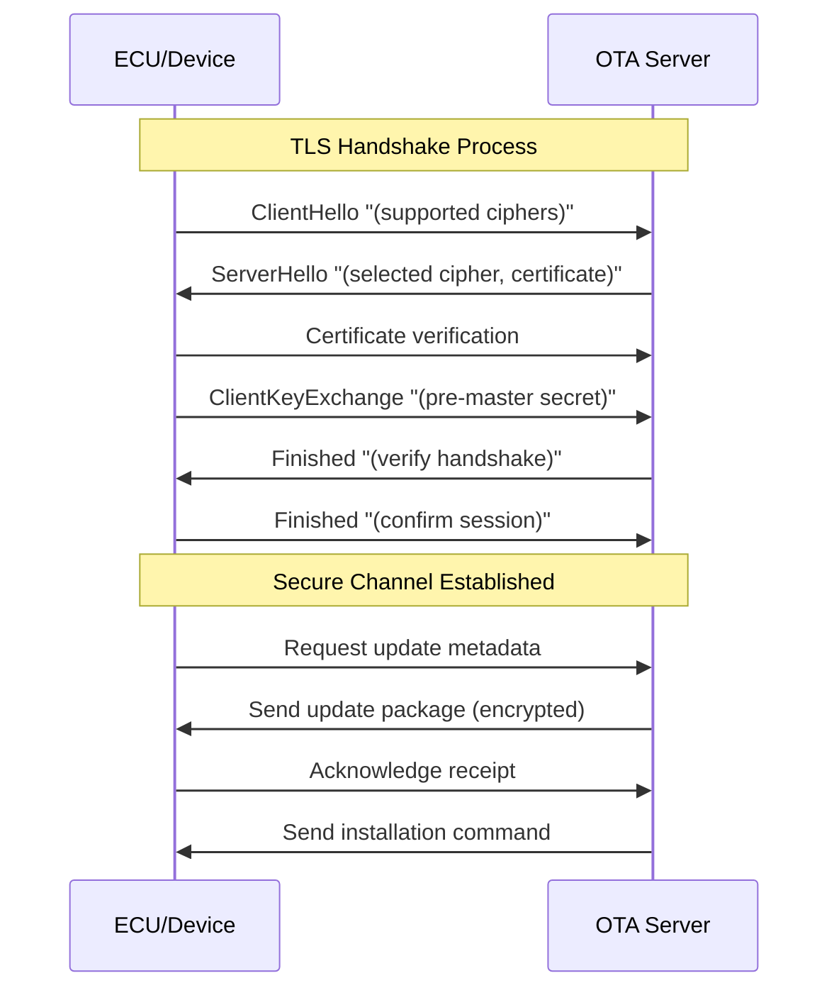
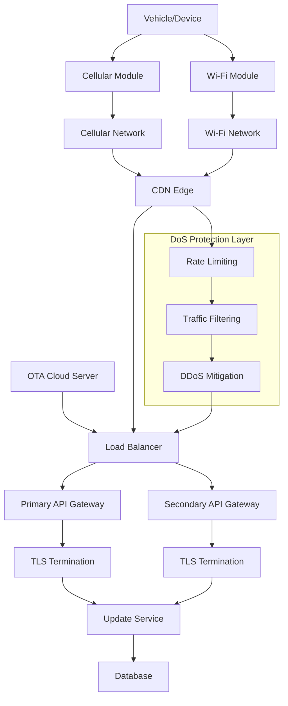

# OTA Security: Denial-of-Service Protection

## Introduction

Over-the-Air (OTA) software updates represent a critical infrastructure component in modern connected systems, enabling remote deployment of firmware and software patches to Electronic Control Units (ECUs) and embedded devices. The security of OTA update pipelines is paramount, as these systems face various threats including Denial-of-Service (DoS) attacks that can prevent legitimate updates from reaching their targets. A successful DoS attack on an OTA pipeline can block critical security patches, delay necessary functionality updates, and significantly degrade the operational reliability of connected systems such as vehicles or IoT devices. This documentation examines the protection mechanisms, particularly focusing on Transport Layer Security (TLS) as a fundamental defense against DoS attacks in OTA environments.

## DoS Attack Vectors in OTA Systems

Denial-of-Service attacks against OTA update systems manifest through multiple attack vectors, each targeting different aspects of the update delivery process. The primary attack methodology involves the interception or jamming of communication channels between the cloud-based OTA server and the target device, effectively preventing update packages from reaching their destination. This form of attack exploits the physical or network layer vulnerabilities, creating conditions where legitimate update traffic cannot traverse the communication path.

Another significant attack vector involves resource exhaustion on either the device side or network endpoints. Attackers can craft malicious traffic patterns that consume processing resources, memory, or network buffers, causing the system to drop legitimate packets or stall update sessions. This type of attack is particularly effective against embedded systems with limited computational resources, where even moderate resource consumption can lead to system failure or unresponsiveness.

Protocol interference represents a more sophisticated attack vector where adversaries deliberately disrupt handshake sequences or terminate sessions at critical points in the update process. By manipulating protocol states or injecting malformed packets, attackers can prevent the establishment of secure communication channels necessary for update delivery. These attacks often target the initial connection establishment phase, where systems are most vulnerable to session disruption.

## TLS-Based Protection Mechanisms

Transport Layer Security (TLS) serves as a foundational protection mechanism in OTA update systems, providing a comprehensive security framework for securing communication channels between OTA servers and target devices. TLS establishes a cryptographic channel that delivers three essential security guarantees: confidentiality through encryption, integrity through message authentication, and authentication through digital certificates. These properties collectively create a robust defense against various forms of DoS attacks that rely on protocol manipulation or session hijacking.

The confidentiality aspect of TLS ensures that all data transmitted between the OTA server and device remains encrypted and unintelligible to any intermediary who might intercept the communication stream. This encryption prevents attackers from analyzing update traffic patterns or crafting targeted attacks based on packet contents. Even if an adversary successfully captures network traffic, the encrypted nature of TLS-protected communications renders the captured data useless for attack purposes.

TLS provides integrity protection through the implementation of Message Authentication Codes (MACs) or authenticated encryption mechanisms. These cryptographic constructs ensure that any modification to the transmitted data, whether intentional or accidental, is detected by the receiving party. This integrity protection prevents attackers from injecting malicious packets or modifying legitimate update packages in transit, as any such tampering would be immediately identified and rejected by the TLS implementation.

The authentication component of TLS establishes the identities of communication endpoints through the exchange and verification of digital certificates. During the TLS handshake process, both the OTA server and the target device present certificates that prove their identities to each other. This mutual authentication prevents unauthorized devices from connecting to the OTA infrastructure and stops attackers from masquerading as legitimate servers. The certificate-based authentication mechanism ensures that update communications occur only between verified and trusted endpoints.

## TLS Implementation in OTA Architecture

The implementation of TLS within OTA update systems requires careful consideration of the operational environment and system constraints. In typical OTA deployments, TLS operates over reliable transport protocols such as TCP, though in some embedded or IoT contexts, datagram variants like DTLS may be employed to accommodate connectionless transport requirements. The choice between TLS and DTLS depends on factors such as network reliability, latency requirements, and the specific characteristics of the underlying transport medium.

The TLS handshake process represents a critical phase in establishing secure OTA communication channels. During this handshake, the client and server negotiate cryptographic parameters, exchange certificates for authentication, and derive session keys that will be used to encrypt subsequent communication. This process must complete successfully before any firmware payload is transmitted, ensuring that the update transfer occurs over a verified and secured channel. The handshake mechanism inherently defends against simple network interruptions and spoofing attempts, as any disruption during this phase prevents the establishment of a session for update delivery.

The architectural integration of TLS within OTA systems must address several implementation considerations. Certificate management represents a significant challenge, as devices must maintain trusted root certificates while servers must manage individual device certificates or implement scalable certificate provisioning mechanisms. The certificate infrastructure must support operations such as certificate renewal, revocation, and updates without compromising the security of the OTA channel.

Session management and connection handling also require careful architectural planning. OTA clients must implement robust session recovery mechanisms to handle transient network interruptions without requiring complete session re-establishment. The implementation should support session resumption where possible to reduce the computational overhead of repeated handshakes, particularly important for resource-constrained embedded devices.

## Complementary Security Measures

While TLS provides essential protection for OTA communication channels, comprehensive DoS mitigation requires the implementation of additional security measures that address attack vectors beyond the scope of TLS. Network-level protections form a critical component of a multi-layered defense strategy, addressing volumetric attacks that attempt to overwhelm communication infrastructure through sheer traffic volume. These measures include traffic filtering, rate limiting, and capacity provisioning designed to absorb or mitigate large-scale attack traffic.

Redundant connectivity and failover mechanisms significantly enhance the resilience of OTA update systems against DoS attacks. Vehicles and IoT devices often support multiple communication interfaces, such as cellular, Wi-Fi, and potentially satellite connections. Implementing automatic failover between these communication paths ensures that update delivery can continue even if one communication channel is compromised or saturated by attack traffic. This redundancy creates multiple potential paths for update delivery, making it significantly more difficult for attackers to successfully block all communication channels.

Health monitoring and adaptive backoff strategies provide additional protection against sustained DoS attempts. OTA clients should implement sophisticated health checking mechanisms that can distinguish between legitimate network failures and potential attack conditions. When connection failures are detected, clients should employ exponential backoff strategies that gradually increase retry intervals while implementing jitter to prevent synchronization effects that could amplify attack impact. These mechanisms prevent resource exhaustion on both client devices and network infrastructure while maintaining the possibility of eventual successful update delivery.

The implementation of mutual authentication, where both the OTA server and the device authenticate each other using certificates, provides stronger protection against certain types of DoS attacks. This approach prevents unauthorized devices from consuming server resources through connection attempts and stops attackers from establishing malicious sessions that could be used to launch application-layer attacks. Mutual authentication should be implemented using modern cryptographic algorithms and proper certificate validation procedures to maintain security effectiveness.

## Limitations and Considerations

Despite its comprehensive security properties, TLS does not provide complete protection against all forms of DoS attacks. Volumetric attacks that target network infrastructure or attempt to overwhelm device processing capabilities remain outside the direct protection scope of TLS. These attacks operate at lower layers of the network stack, where TLS encryption and authentication mechanisms cannot directly intervene. The computational overhead of TLS handshake processing can itself become a target for DoS attacks, as attackers may initiate numerous connection attempts to exhaust server resources through repeated cryptographic operations.

The effectiveness of TLS protection depends heavily on proper implementation and configuration. The use of outdated TLS versions or misconfigured cipher suites can introduce vulnerabilities that attackers might exploit to disrupt OTA communications. TLS 1.3 represents the current standard for secure communications, offering improved security through the removal of insecure algorithms and reduced handshake complexity. Organizations implementing OTA systems must ensure their TLS implementations support current protocol versions and are configured according to security best practices.

Resource constraints on embedded devices present additional challenges for TLS implementation in OTA systems. The computational requirements of cryptographic operations, particularly asymmetric cryptography used during the TLS handshake, can be significant for resource-constrained ECUs. This limitation may require careful optimization of TLS implementations or the use of hardware acceleration for cryptographic operations. Device manufacturers must balance security requirements against available resources to ensure that TLS protection does not itself become a performance bottleneck or point of failure.

## Conclusion

The protection of OTA update systems against Denial-of-Service attacks requires a comprehensive, multi-layered security approach that combines cryptographic protections with architectural resilience. TLS serves as a fundamental component of this protection strategy, providing essential confidentiality, integrity, and authentication guarantees that secure the communication channel between OTA servers and target devices. The proper implementation of TLS, particularly using current protocol versions like TLS 1.3 and incorporating mutual authentication, establishes a robust foundation for secure update delivery.

However, TLS alone cannot address all potential DoS attack vectors. A complete security solution must incorporate network-level protections, redundant connectivity options, and intelligent client-side retry mechanisms to address volumetric attacks and network infrastructure vulnerabilities. The integration of these complementary measures creates a defense-in-depth strategy that can withstand various forms of DoS attacks while maintaining the availability and reliability of OTA update services.

The ongoing evolution of both attack techniques and defensive measures requires continuous attention to OTA security practices. Organizations must regularly review and update their security implementations to address emerging threats and incorporate improved protection mechanisms. Through careful attention to cryptographic best practices, architectural design, and operational procedures, OTA systems can achieve the level of security and reliability necessary for supporting critical software updates in connected vehicle and IoT environments.