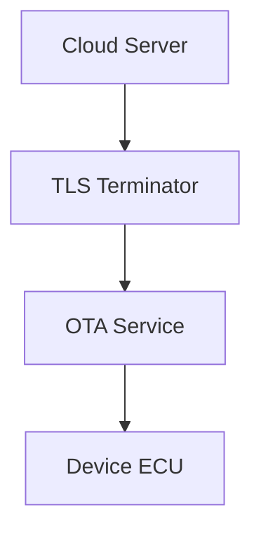
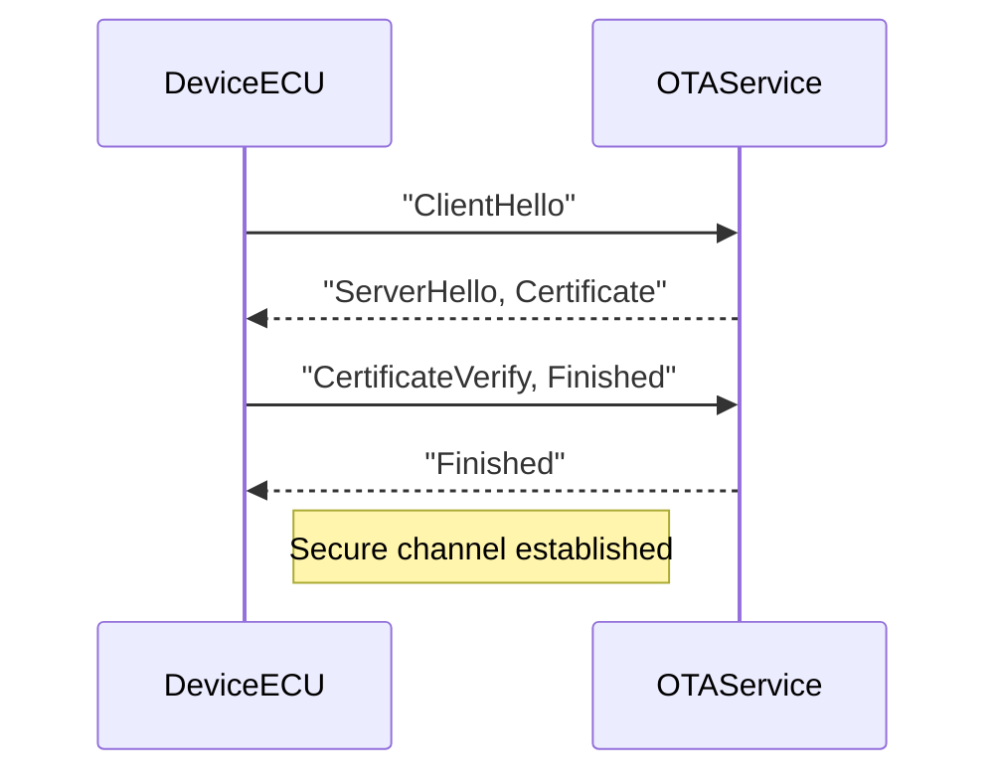
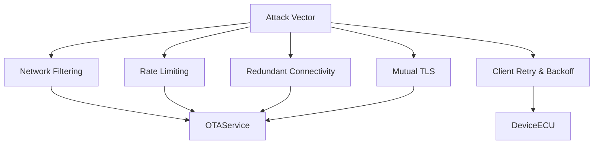

# OTA Denial‑of‑Service (DoS) Protection Technical Documentation

## 1. Introduction
A denial‑of‑service attack on an Over‑the‑Air (OTA) update system aims to **prevent the delivery or application of firmware updates**. Unlike confidentiality attacks, the adversary does not need to read or modify the firmware; simply blocking or delaying the update is sufficient. This can lead to missed security patches, degraded reliability, and increased safety risk in connected vehicles and embedded devices.

## 2. Threat Landscape
| Attack Vector | Description |
|---|---|
| **Communication Interference** | Jamming, selective packet dropping, or protocol manipulation between the OTA backend and the ECU. |
| **Resource Exhaustion** | Flooding the OTA server or the device with bogus requests, causing session stalls or memory/CPU depletion. |
| **Handshake Disruption** | Interrupting TLS handshake messages, forcing repeated retries or aborting the session. |

## 3. TLS as a Core Mitigation Layer
TLS provides three critical guarantees that directly counter protocol‑level DoS attempts:
1. **Confidentiality** – Encrypted payloads cannot be understood or selectively altered.
2. **Authentication** – Mutual authentication ensures that only legitimate ECUs talk to the genuine OTA server.
3. **Integrity** – Any tampering of messages is detected, causing the session to terminate safely.

### 3.1 TLS Deployment Options
- **TLS 1.3** – Preferred for its reduced handshake latency and removal of weak ciphers.
- **DTLS** – Used over UDP for constrained environments.
- **Mutual TLS (mTLS)** – Both sides present certificates, preventing rogue devices from consuming backend resources.

## 4. Limitations of TLS
While TLS thwarts **application‑level** disruptions, it **does not stop volumetric attacks** that saturate bandwidth or overwhelm processing capacity. Defending against such attacks requires additional network‑level controls.

## 5. Multi‑Layer Defense Architecture
Below is a high‑level view of the OTA pipeline with TLS integration.

### 5.1 TLS Handshake Sequence
The handshake establishes a secure channel before any firmware data is transmitted.

### 5.2 Layered DoS Defense Model
Each layer addresses a specific class of DoS threats.

## 6. Best Practices Checklist
- **Use TLS 1.3** with strong cipher suites.
- **Enable mutual authentication** (certificate validation on both ends).
- **Implement exponential backoff** and retry limits on the ECU.
- **Provide dual connectivity** (cellular + Wi‑Fi) with automatic failover.
- **Deploy network edge defenses**: firewalls, DDoS scrubbing, rate limiters.
- **Monitor health metrics** (session latency, error rates) and trigger alerts on anomalies.

## 7. Conclusion
Protecting OTA update delivery against DoS attacks requires a **defense‑in‑depth** approach. TLS secures the communication channel against protocol‑level interference, while architectural measures—redundant paths, client‑side resilience, and network‑level filtering—address large‑scale flooding and resource‑exhaustion attacks. Together, these layers ensure that OTA pipelines remain available, reliable, and secure even under adversarial conditions.