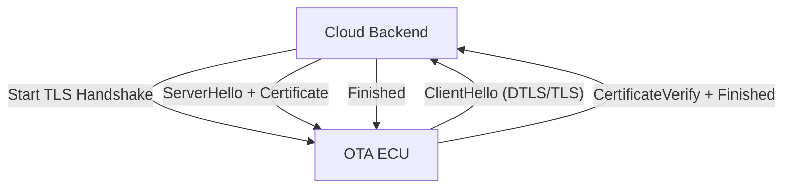
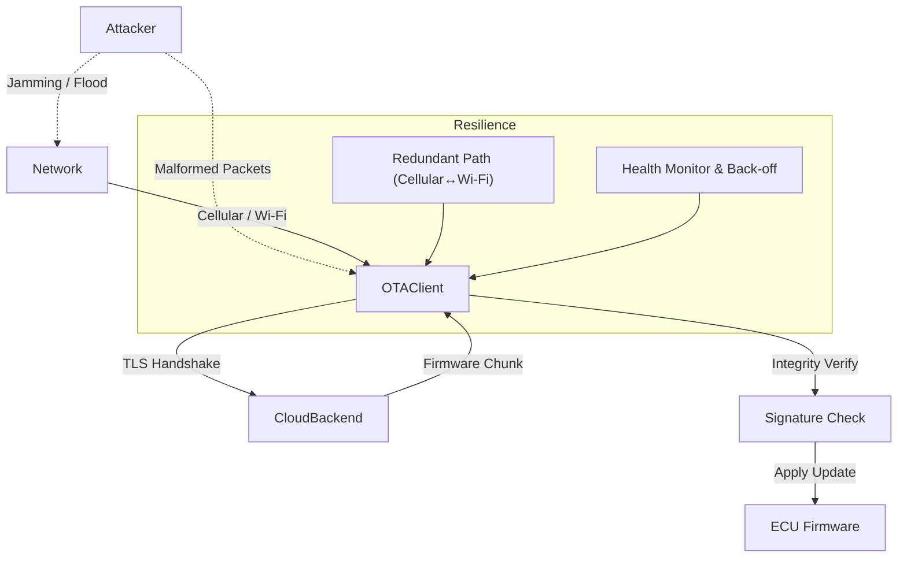

# OTA Denial‑of‑Service (DoS) Protection – In‑Depth Guide

---

## 1. Introduction
A denial‑of‑service attack on an OTA (Over‑the‑Air) system aims to **prevent a firmware update from being delivered or applied** on the target ECU. The attacker does **not** need to read or modify the firmware; simply blocking or corrupting the delivery chain is sufficient. In connected vehicles, such interruptions can delay critical security patches, degrade reliability, and increase safety risk.

---

## 2. Typical OTA DoS Attack Vectors
| Vector | Description | Impact |
|--------|-------------|--------|
| **Network Jamming / Interference** | Radio‑frequency jamming or selective packet loss on the cellular/Wi‑Fi link. | Updates stall or time‑out. |
| **Traffic Flooding** | High‑volume UDP/TCP packets saturate bandwidth or overwhelm the OTA server. | Bandwidth exhaustion, server overload. |
| **Resource Exhaustion on ECU** | Malformed OTA messages force the ECU to allocate memory or CPU repeatedly. | ECU becomes unresponsive, battery drain. |
| **Protocol Handshake Disruption** | Dropping or tampering with TLS handshake messages. | Session fails, update never starts. |
| **Session Hijacking Attempts** | Attacker injects fake handshake messages to force renegotiation. | Connection reset, possible lock‑out. |

---

## 3. TLS – Core Defensive Layer
TLS (or DTLS for datagram transports) provides three critical guarantees that directly mitigate many OTA‑DoS techniques:

1. **Encryption** – Prevents an eavesdropper from reading or selectively modifying packets.
2. **Authentication** – Mutual verification of server and ECU certificates ensures only legitimate parties can complete the handshake.
3. **Integrity** – Any tampering of ciphertext is detected, causing the session to abort safely.

### 3.1 TLS Handshake Flow (pre‑data phase)

*The handshake occurs over a reliable transport (TCP) or DTLS for constrained links. Successful completion establishes a cryptographic channel before any firmware bytes are transmitted.*

### 3.2 TLS Mitigations
- **Handshake Authentication** blocks impersonation of the OTA server.
- **Cipher‑suite selection (TLS 1.3)** removes weak algorithms, reduces round‑trips, and limits exposure to downgrade attacks.
- **Integrity checks** cause any injected or corrupted packets to abort the session, preventing silent data corruption.

---

## 4. Limits of TLS Against DoS
| Limitation | Why TLS Cannot Stop It | Countermeasure |
|------------|-----------------------|----------------|
| **Volumetric Flooding** | TLS operates at the application layer; it cannot throttle raw traffic before the handshake. | Network‑level rate limiting, DDoS scrubbing services, ISP traffic shaping. |
| **Resource Exhaustion on Endpoint** | Handshake processing still consumes CPU/memory even for malformed packets. | Connection quotas, early abort after malformed hello, hardware offload. |
| **Physical Jamming** | RF interference blocks the radio link entirely, independent of cryptography. | Redundant communication paths (cellular ↔ Wi‑Fi ↔ satellite), adaptive modulation, link‑layer retransmission. |

---

## 5. Architectural & Operational Defenses
1. **Redundant Connectivity** – Switch between cellular, Wi‑Fi, or satellite links based on link health.
2. **Mutual TLS (mTLS)** – Both sides present certificates; unauthorized devices cannot waste server resources.
3. **Health Monitoring & Exponential Back‑off** – ECU tracks consecutive failures, backs off with jitter, and respects retry limits.
4. **Session Resumption** – TLS 1.3 session tickets reduce handshake cost, limiting exposure to repeated handshake attacks.
5. **Network‑Level Controls** –
   - Rate limiting per IP/device.
   - IP reputation / black‑listing.
   - Edge firewalls with deep‑packet inspection for TLS anomalies.
6. **Capacity Planning** – Over‑provision bandwidth and compute resources to absorb burst traffic.
7. **Secure Boot & Rollback Protection** – Guarantees that a partially received update cannot be applied, preventing a “partial‑flash” DoS.

---

## 6. Best‑Practice Checklist
- **Use TLS 1.3** with only AEAD cipher suites (e.g., TLS_AES_128_GCM_SHA256).
- **Enable Mutual Authentication** – Deploy device certificates stored in a TPM or secure element.
- **Implement DTLS** for UDP‑based transports where latency is critical.
- **Configure Session Ticket Lifetime** to balance performance and security.
- **Deploy Redundant Radio Paths** with automatic fail‑over logic.
- **Apply Network Rate Limiting** at the edge (e.g., 10 Mbps per device, burst allowance).
- **Log Handshake Failures** and trigger alerts after a threshold (e.g., >5 failures in 1 min).
- **Use Exponential Back‑off** with jitter for retry logic on the ECU.
- **Validate Firmware Signatures** after download, before flashing, to reject corrupted payloads.

---

## 7. End‑to‑End OTA DoS Mitigation Flow

*The diagram shows attacker interference points, TLS‑protected communication, and built‑in resilience mechanisms (redundant path, health monitor).*

---

## 8. Conclusion
TLS is a **foundational** defense that secures the OTA channel against protocol‑level manipulation, spoofing, and tampering. However, **DoS resilience requires a layered approach**: modern TLS configurations, mutual authentication, robust client‑side retry logic, and network‑level traffic management. By combining cryptographic guarantees with architectural redundancy and operational safeguards, OTA pipelines can maintain availability and reliability even under adversarial conditions.

GUIDANCE:
- Use 'thought_process' to list the errors you found.
- Return the fixed markdown in 'content'.