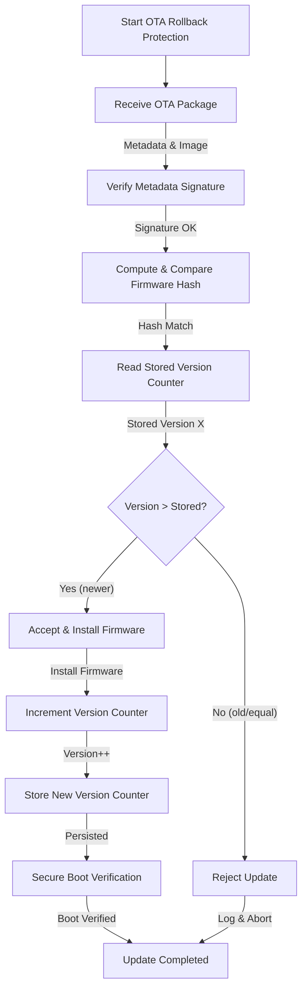

# OTA Rollback Attack Prevention

## 1. Overview
A **rollback (downgrade) attack** forces a device to reinstall an older firmware image that is known to contain vulnerabilities. Even if those flaws were patched in later releases, re‑installing the older image re‑introduces the risk, compromising the integrity and security guarantees of the OTA process.

The **core principle** of rollback protection is simple:

> **A device must never accept firmware whose version identifier is lower than the version it already runs.**

Achieving this requires a combination of cryptographic validation, immutable version state, and hardware‑assisted enforcement.

---

## 2. Threat Model
| Actor | Capability | Goal |
|-------|------------|------|
| Remote attacker | Intercept OTA traffic, replay old packages | Install vulnerable firmware (e.g., v5) on a device running v7 |
| Physical attacker | Access to device debug ports, flash memory | Reset or tamper version counter to a lower value |
| Insider (malicious OEM) | Sign malicious metadata | Bypass version checks |

**Mitigations** focus on authenticating metadata, protecting the version counter, and enforcing checks as early as possible (boot time).

---

## 3. End‑to‑End Rollback Protection Flow

### 3.1 Detailed Steps
1. **Package Reception** – The ECU receives a signed OTA bundle containing:
   - Firmware image
   - Metadata (version, hash, size, etc.)
2. **Metadata Signature Verification** – Using a manufacturer‑provisioned public key, the ECU verifies the digital signature. This guarantees the authenticity of the version identifier.
3. **Hash Verification** – The ECU computes a cryptographic hash (e.g., SHA‑256) of the received image and compares it to the hash stored in the signed metadata.
4. **Version State Retrieval** – The current firmware version (or anti‑rollback counter) is read from a **tamper‑resistant, non‑volatile store**.
5. **Version Comparison** – If `incoming_version <= stored_version`, the update is rejected. Only strictly higher versions are accepted.
6. **Counter Update & Persistence** – Upon successful installation, the version counter is atomically incremented and written back to the secure store.
7. **Secure Boot Enforcement** – During the next boot, the bootloader validates the installed firmware again and ensures the stored version matches the image.

---

## 4. Secure Version State Storage
| Storage Mechanism | Characteristics | Typical Use Cases |
|-------------------|----------------|------------------|
| **Secure Flash (e.g., ARM TrustZone‑protected region)** | Read‑write, cryptographically protected, can be sealed with a key. | General‑purpose ECUs with enough flash space. |
| **One‑Time Programmable (OTP) Fuses** | Write‑once, immutable after programming. | Critical counters that must never roll back. |
| **Hardware Monotonic Counter (e.g., TPM NV index, Secure Element counter)** | Increment‑only, cannot be reset without destructive action. | Highest security, resistant to physical attacks. |
| **Secure EEPROM with anti‑tamper sensors** | Limited write cycles, but can be hardened with sensors. | Legacy devices where flash is unavailable. |

**Design Recommendations**
- Store the version counter in a *hardware‑backed* location whenever possible.
- Protect the storage region with access control (e.g., TrustZone, MPU).
- Use atomic write‑verify sequences to avoid corruption during power loss.

---

## 5. Hardware‑Assisted Countermeasures
1. **Monotonic Counters** – Built‑in hardware registers that only allow increment operations. Even a privileged attacker cannot decrement them.
2. **Secure Boot** – The bootloader validates the firmware image and its version before execution, ensuring rollback protection is enforced at the earliest stage.
3. **Root of Trust for Measurement (RTM)** – Records the version number in a tamper‑evident log (e.g., TPM PCR) that can be audited later.

---

## 6. Standards & Frameworks
- **Uptane** – Extends The Update Framework (TUF) for automotive OTA. It mandates version monotonicity and rejects metadata with older version numbers.
- **AUTOSAR Adaptive Platform** – Defines a *Secure Update* interface that includes anti‑rollback checks.
- **IoT Security Guidelines (e.g., NIST SP 800‑183)** – Recommend immutable version counters and signed metadata.

---

## 7. Best‑Practice Checklist
- [ ] **Signed Metadata** – All OTA bundles must include a cryptographically signed metadata file.
- [ ] **Hash Verification** – Verify the image hash before any version logic.
- [ ] **Strict Version Comparison** – Accept only `incoming_version > stored_version`.
- [ ] **Tamper‑Resistant Storage** – Store the version counter in secure flash, OTP fuses, or a hardware monotonic counter.
- [ ] **Atomic Counter Update** – Increment and persist the version atomically after a successful install.
- [ ] **Secure Boot Integration** – Enforce version checks during boot.
- [ ] **Audit Logging** – Log every reject/accept event with timestamps and version numbers.
- [ ] **Fail‑Secure Default** – On any verification failure, abort the update and keep the currently running firmware.
- [ ] **Periodic Counter Health Checks** – Verify monotonicity of the stored counter during routine diagnostics.
- [ ] **Compliance Testing** – Validate against Uptane/TUF test suites for anti‑rollback behavior.

---

## 8. Conclusion
Rollback protection is a **multi‑layered defense** that couples cryptographic assurance (signed metadata, hash verification) with immutable version state and hardware enforcement. By ensuring that a device can only move forward in its firmware lifecycle, OTA systems maintain long‑term integrity, prevent re‑introduction of known vulnerabilities, and uphold the security guarantees required in automotive and IoT deployments.
