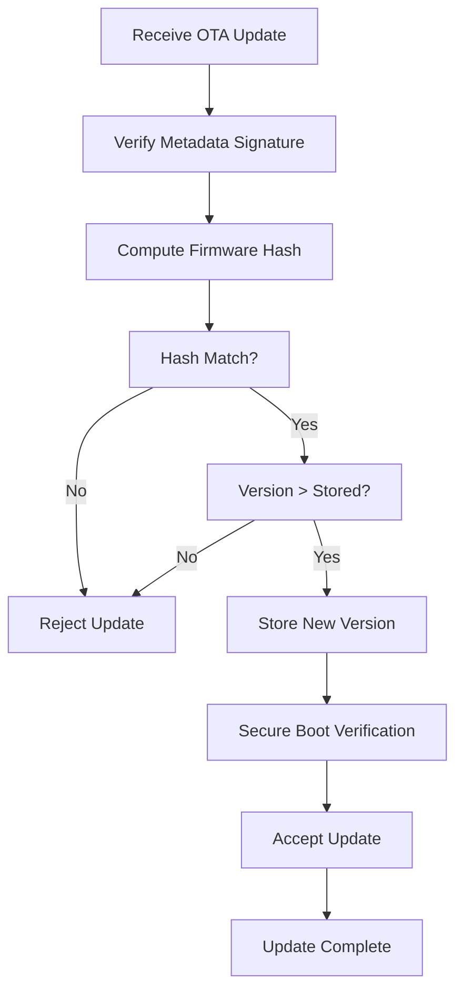

# Rollback Attack Prevention in OTA Systems

---

## 1. Overview
A **rollback (downgrade) attack** forces a device to reinstall an older firmware version that contains known vulnerabilities. Preventing this is essential for maintaining the long‑term security and integrity of OTA‑enabled devices.

---

## 2. Threat Model
| Actor | Goal | Typical Vector |
|-------|------|----------------|
| Attacker (remote or local) | Re‑install vulnerable firmware (e.g., v5) when device already runs a newer, patched version (e.g., v7) | Replay of old OTA packages, manipulation of version state, tampering with storage |

---

## 3. Core Components
1. **Signed Update Metadata** – Contains version number, image hash, and is signed by the OEM.
2. **Cryptographic Hash Verification** – Ensures the received image matches the hash in the metadata.
3. **Version Enforcement Logic** – Accepts only firmware with a version **greater** than the stored version.
4. **Secure Version State Storage** – Non‑volatile, tamper‑resistant storage (e.g., secure flash, OTP fuses, hardware monotonic counters).
5. **Hardware‑Backed Protections** – Secure boot, hardware counters, and Trusted Execution Environments (TEE).

---

## 4. Detailed Processing Flow
The diagram below illustrates the end‑to‑end verification and rollback‑prevention steps performed by an ECU.

**Explanation of Nodes**
- **Receive OTA Update** – The ECU receives a package containing firmware and signed metadata.
- **Verify Metadata Signature** – Uses the OEM‑provisioned public key to confirm authenticity.
- **Compute Firmware Hash** – Calculates a cryptographic hash (e.g., SHA‑256) of the binary.
- **Hash Match?** – If the computed hash differs from the one in metadata, the update is rejected.
- **Version > Stored?** – The ECU compares the incoming version against the securely stored version/anti‑rollback counter.
- **Store New Version** – Upon successful verification, the new version number (or counter) is atomically written to protected storage.
- **Secure Boot Verification** – The bootloader re‑validates the image before execution, providing a second line of defense.
- **Accept/Reject** – Final decision and subsequent actions.

---

## 5. Secure Storage of Version State
| Storage Mechanism | Characteristics |
|-------------------|-----------------|
| Secure Flash (e.g., encrypted NVM) | Read/write with tamper detection, can be protected by MPU/TrustZone. |
| One‑Time Programmable (OTP) fuses | Write‑once, monotonic, ideal for immutable counters. |
| Hardware Monotonic Counter | Increment‑only, resistant to reset attacks, often integrated in secure elements. |

The version or counter must be **atomically** updated only after all cryptographic checks have passed.

---

## 6. Hardware‑Backed Reinforcement
- **Secure Boot** – Verifies the boot image signature and version before handing control to the OS.
- **Trusted Execution Environment (TEE)** – Isolates verification code and protects the version state.
- **Hardware Security Modules (HSM) / Secure Elements** – Store OEM public keys and perform signature verification in a tamper‑resistant enclave.
- **Monotonic Counters** – Prevent rollback even if an attacker gains privileged software access.

---

## 7. Standards & Frameworks
- **Uptane** – Defines signed metadata (Root, Timestamp, Snapshot, Targets) and mandates version number monotonicity.
- **AUTOSAR Adaptive** – Provides specifications for secure OTA, including anti‑rollback counters.
- **IoT Security Guidelines (e.g., NIST SP 800‑183)** – Recommend version enforcement and protected storage.

---

## 8. Best‑Practice Checklist
1. **Provision OEM public key in immutable hardware** during manufacturing.
2. **Sign all OTA metadata** with a strong algorithm (e.g., ECDSA‑P256).
3. **Include a monotonically increasing version field** in every metadata bundle.
4. **Store the current version/anti‑rollback counter** in a tamper‑resistant, non‑volatile location.
5. **Perform hash verification** before any version comparison.
6. **Enforce version checks in both OTA client and secure bootloader** (defense‑in‑depth).
7. **Audit and test rollback scenarios** regularly (e.g., replay old packages in a controlled lab).
8. **Rotate signing keys** according to a defined lifecycle and revoke compromised keys promptly.

---

## 9. Conclusion
Rollback attack prevention is a **multi‑layered** safeguard that combines cryptographic assurance (signed metadata, hash verification) with strict version enforcement backed by secure, immutable storage. When implemented correctly—leveraging hardware counters, secure boot, and standards such as Uptane—devices can guarantee forward‑only firmware progression, eliminating the risk of re‑introducing known vulnerabilities.