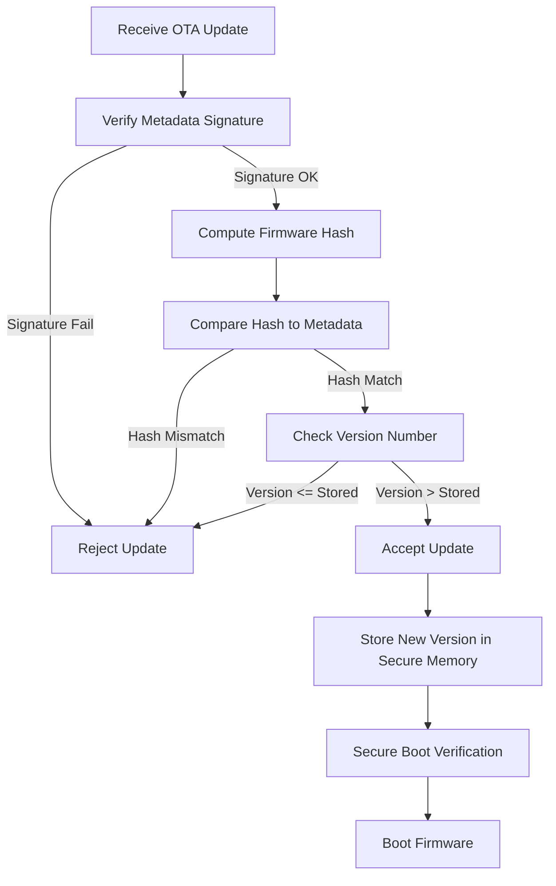

# Rollback Attack Prevention in OTA Systems

A **rollback (downgrade) attack** forces a device to install an older, vulnerable firmware version. Preventing this requires a combination of cryptographic validation, strict version enforcement, and secure storage of version state.

---
## Core Protection Mechanisms

1. **Signed Update Metadata**
   - Contains version number, firmware hash, and other descriptors.
   - Digitally signed by the OEM; the ECU verifies the signature with a provisioned public key.
2. **Hash Verification**
   - The ECU computes a cryptographic hash of the received image and compares it to the hash in the signed metadata.
3. **Version Enforcement**
   - The ECU stores the highest accepted version (or an anti‑rollback counter) in tamper‑resistant non‑volatile memory.
   - An incoming update is accepted **only if** its version is **greater** than the stored version.
4. **Secure Storage of Version State**
   - Implemented via secure flash, one‑time programmable fuses, or hardware monotonic counters that cannot be reset.
5. **Hardware‑Backed Support**
   - **Monotonic counters** in hardware enforce ever‑increasing version numbers.
   - **Secure boot** validates the firmware before execution, rejecting any older or unauthenticated image.
6. **Framework Adoption**
   - Standards such as **Uptane** explicitly reject metadata/firmware with lower version numbers, ensuring replayed old images cannot be installed.

---
## End‑to‑End Flow

The diagram below visualises the typical OTA update processing pipeline, highlighting where each protection step occurs and the decision points that lead to acceptance or rejection of an update.

---
## Summary

- **Cryptographic validation** guarantees that both the metadata and the firmware image are authentic and untampered.
- **Strict version comparison** enforces forward‑only updates, eliminating the possibility of reinstalling vulnerable older releases.
- **Secure, hardware‑backed storage** of the version counter prevents attackers from resetting or forging the stored state.
- **Secure boot** adds a final gate, refusing to execute any firmware that fails the version or authenticity checks.

Together, these layers create a robust defense against rollback attacks, ensuring that OTA‑enabled devices maintain a continuously improving security posture.