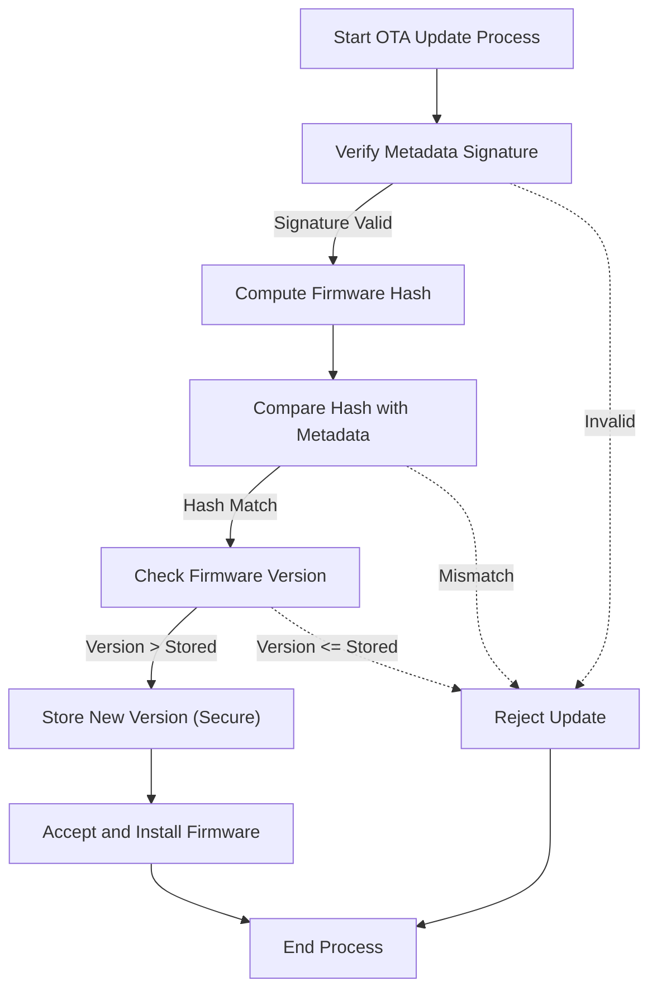
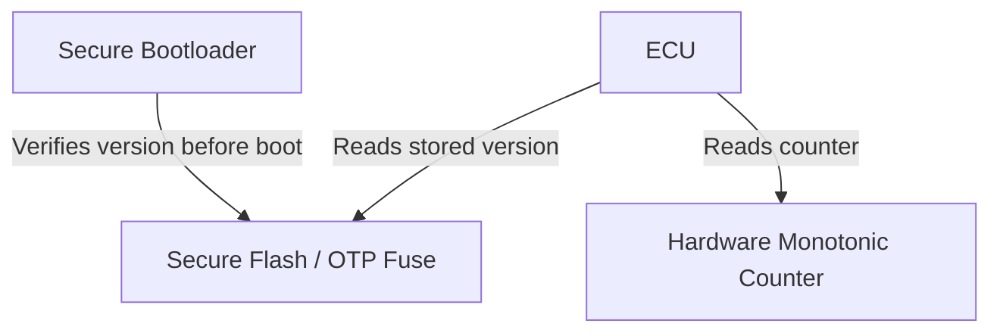
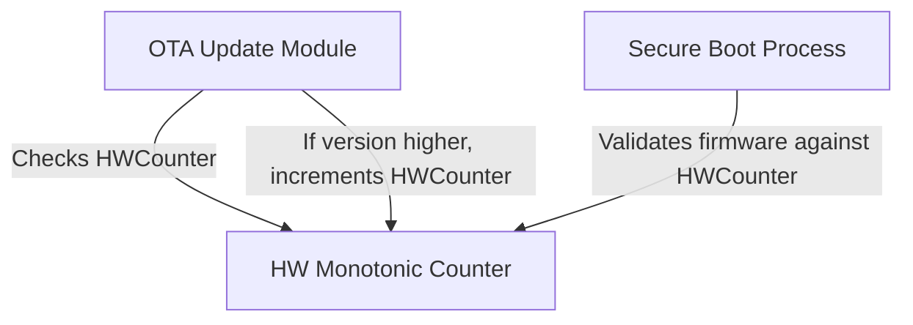

# OTA Rollback Attack Prevention

## Overview
A **rollback (downgrade) attack** forces a device to reinstall an older, vulnerable firmware version. Preventing this requires **cryptographic validation** and **strict version enforcement** so that a device never accepts firmware with a version identifier lower than the one already installed.

---
## Threat Model
| Actor | Goal | Capability |
|-------|------|------------|
| Attacker | Re‑install vulnerable firmware | Replay old OTA packages, tamper with metadata, attempt to reset version state |
| Insider | Manipulate version storage | Access to non‑volatile memory, limited hardware control |

---
## Core Protection Mechanisms
1. **Signed Metadata** – OEM signs a JSON/YAML manifest containing `version`, `hash`, and other descriptors.
2. **Hash Verification** – ECU computes a cryptographic hash of the received image and matches it against the signed manifest.
3. **Version Comparison** – The ECU compares the manifest `version` with the stored version (or monotonic counter). Updates with `version <= stored` are rejected.
4. **Secure Version Storage** – The current version or counter is kept in tamper‑resistant non‑volatile memory (secure flash, OTP fuses, hardware monotonic counters).
5. **Secure Boot Integration** – The bootloader re‑checks the version before handing control to the firmware, guaranteeing protection from the earliest execution point.

---
## OTA Rollback Protection Flow

---
## Secure Version Storage Architecture

---
## Hardware‑Backed Rollback Prevention

---
## Best‑Practice Checklist
- **Always sign OTA metadata** with a strong asymmetric key pair.
- **Include a monotonically increasing version number** (semantic or integer) in the manifest.
- **Store the current version** in tamper‑resistant memory (secure flash, OTP fuses, or hardware counter).
- **Verify the hash** of the received image before any version check.
- **Enforce version checks** in both the OTA client and the secure bootloader.
- **Use hardware monotonic counters** where available to make rollback impossible even after a full memory wipe.
- **Audit and rotate signing keys** regularly; revoke compromised keys promptly.
- **Log all update attempts** (including rejected ones) for forensic analysis.

---
## References
- **Uptane** – Open‑source OTA security framework that mandates rollback protection.
- **ISO/SAE 21434** – Road vehicles cybersecurity standard, Section on OTA update integrity.
- **NIST SP 800‑193** – Platform firmware resilience guidelines.

---
*By combining cryptographic guarantees with immutable version state, OTA systems can reliably prevent rollback attacks and maintain long‑term device integrity.*