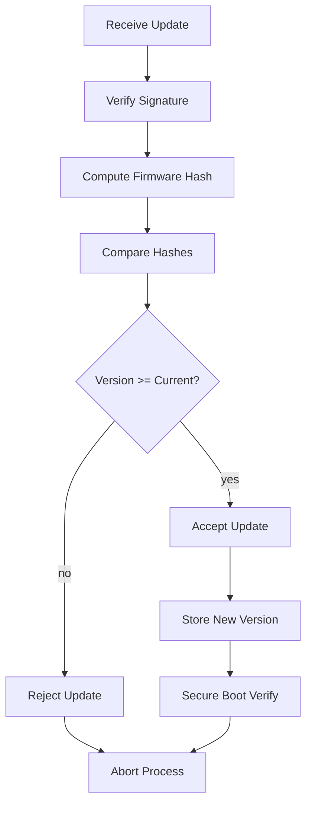
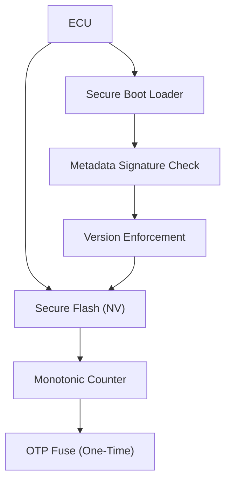

# Rollback Attack Prevention in OTA Systems

## Overview
A **rollback (downgrade) attack** forces a device to install an older firmware version that contains known vulnerabilities. Preventing this requires a combination of cryptographic validation, strict version enforcement, and tamper‑resistant storage of version state.

---
## Core Principles
1. **Signed Metadata** – Firmware version and hash are bundled in metadata signed by the OEM.
2. **Integrity Verification** – The ECU validates the signature and recomputes the firmware hash.
3. **Monotonic Version Check** – The incoming version must be *greater* than the stored version.
4. **Secure Version Storage** – Current version or anti‑rollback counter is kept in non‑volatile, tamper‑resistant memory (e.g., secure flash, OTP fuses, hardware monotonic counters).
5. **Hardware‑Backed Enforcement** – Secure boot and hardware counters enforce the rule before any code executes.

---
## Verification Flow Diagram

**Explanation**
- The ECU first **verifies the metadata signature** using the OEM‑provisioned public key.
- It then **hashes the received image** and checks it against the signed hash.
- A **decision node** (`Check_Version`) ensures the new version is strictly greater than the stored version.
- On success, the new version is **persisted** in secure storage and the bootloader re‑validates it on next boot.

---
## Secure Version Storage Architecture

- **Secure Flash** holds the current version number in a protected region.
- **Monotonic Counter** (hardware) guarantees the value can only increase.
- **OTP Fuse** can be used as an immutable baseline version.
- The **Secure Boot Loader** re‑checks the version before handing control to the firmware.

---
## Implementation Checklist
- [ ] Provision OEM public key in immutable hardware during manufacturing.
- [ ] Sign every OTA metadata package (version, hash, image identifier).
- [ ] Store the current firmware version in a hardware‑backed monotonic counter or secure flash.
- [ ] Enforce *strictly greater* version comparison in the bootloader and OTA client.
- [ ] Reject any update where `incoming_version <= stored_version`.
- [ ] Log all verification steps for auditability.
- [ ] Align with standards such as **Uptane**, **AUTOSAR Secure Onboard Communication**, and **IoT Security Guidelines**.

---
## References
- **Uptane** – Open‑source OTA security framework that mandates version monotonicity.
- **AUTOSAR Secure Onboard Communication (SecOC)** – Defines cryptographic protection for automotive messages.
- **NIST SP 800‑193** – Guidelines for secure boot and firmware integrity.