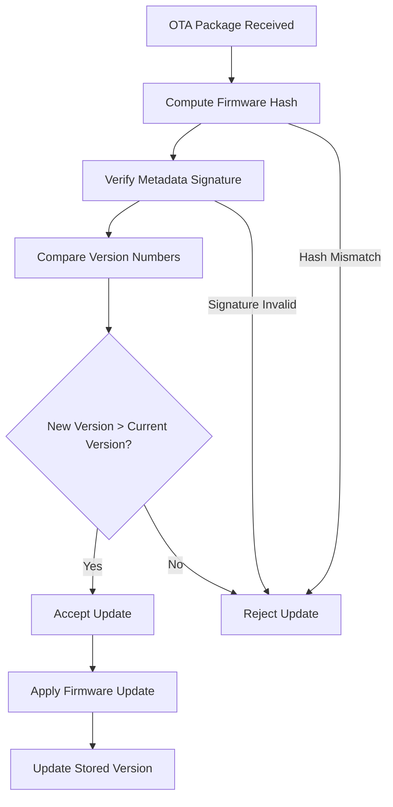
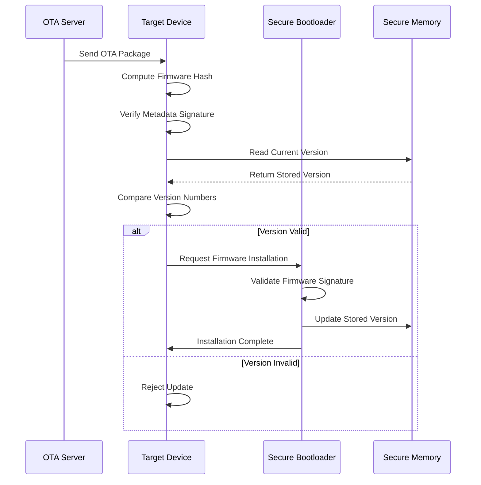

# OTA Security: Rollback Attack Prevention

## Introduction to Rollback Attacks in OTA Systems

A rollback attack represents a significant security threat in Over-The-Air (OTA) update systems, where an adversary deliberately forces a device to install and execute an older version of firmware containing known vulnerabilities. This type of attack, also referred to as a downgrade attack, effectively undermines the security improvements delivered through subsequent firmware updates by re-exposing previously patched security flaws. The impact of such attacks extends beyond individual device compromise, potentially affecting entire fleets of connected devices that rely on timely security updates. Secure OTA frameworks must therefore incorporate robust mechanisms to prevent rollback by enforcing strict version progression and systematically rejecting outdated firmware images. These protective measures are universally recognized as essential components of comprehensive OTA security best practices, forming a critical defense layer in the overall security architecture of connected systems.

## Threat Model and Attack Scenarios

In typical OTA deployment scenarios, a device such as an Electronic Control Unit (ECU) may be operating with firmware version "5" while a newer update version "7" becomes available through the update server. An attacker with malicious intent could attempt to manipulate the update process by presenting the device with an older, known-vulnerable version of the firmware, such as version "5" or even earlier versions. The objective of this attack is to reintroduce security vulnerabilities that were addressed in subsequent updates, thereby creating an exploitable attack surface. Anti-rollback protection mechanisms are specifically designed to prevent such scenarios by ensuring that devices maintain awareness of their current firmware version and systematically reject any update attempts with version identifiers that are lower than or equal to the currently installed version. This version-based filtering serves as a fundamental control mechanism in preventing successful rollback attacks, even when attackers possess valid firmware images from previous releases.

## Anti-Rollback Protection Architecture

The architecture for preventing rollback attacks in OTA systems incorporates multiple layers of security controls that work in concert to ensure firmware version integrity. The protection framework begins with cryptographically signed update metadata that contains essential information including version numbers, cryptographic hashes, and digital signatures. This metadata is validated using public keys that are provisioned during the device manufacturing process, establishing a root of trust for update verification. The verification process involves multiple sequential checks that must all pass successfully before an update can be applied to the device. The system maintains persistent storage of the current firmware version in secure, tamper-resistant memory, creating a reliable reference point for version comparison during update attempts. This architectural approach ensures that even sophisticated attackers with physical access to devices cannot successfully bypass version enforcement mechanisms through conventional means.

## Signed Metadata and Version Enforcement Mechanisms

The cornerstone of effective rollback prevention lies in the implementation of signed update metadata that incorporates version information and cryptographic hashes in a tamper-evident format. When an OTA package is received by the target device, the ECU initiates a comprehensive verification process that begins with computing the cryptographic hash of the firmware image contained within the update package. This computed hash is then compared against the hash value included in the signed metadata, ensuring that the firmware image has not been modified or corrupted during transmission. Subsequently, the device verifies the digital signature of the metadata using the embedded public key, which confirms both the authenticity of the update source and the integrity of the metadata contents, including the version number. The critical version comparison step involves checking the metadata version against the current version stored in secure memory. If the new version is determined to be lower than or equal to the currently installed version, the update is immediately rejected, effectively preventing any potential rollback attack. This multi-layered verification process ensures that only forward-progressing, authenticated updates are successfully applied to the device.

## Secure Version Storage Implementation

The effectiveness of anti-rollback mechanisms fundamentally depends on the secure storage of version information within the device's memory architecture. The current firmware version or anti-rollback counter must be maintained in non-volatile, tamper-resistant memory that is protected against unauthorized modification or reset. This secure storage requirement is typically addressed through the use of specialized memory technologies such as one-time programmable fuses, secure flash partitions, or hardware-protected registers. The version storage implementation must ensure that attackers cannot manipulate the version state through software attacks or even physical access to the device. Many systems employ monotonic counters that can only increment and never decrement, creating a mathematical guarantee that version numbers will always progress forward. The bootloader firmware incorporates logic that enforces version policies by requiring any update to exceed the minimum version stored in this protected memory. This hardware-anchored approach to version storage creates a robust foundation for rollback prevention that remains effective even against sophisticated attackers with privileged access to the device.

## Hardware-Backed Protection Strategies

Hardware-level security features provide additional layers of protection against rollback attacks by implementing version enforcement mechanisms that are resistant to software-based attacks. Monotonic counters implemented in hardware represent a particularly effective protection mechanism, as these counters are designed to only increment and cannot be reset through normal software operations. The physical characteristics of these hardware counters ensure that even attackers with physical access to the device cannot manipulate the version state to bypass rollback protections. Secure boot processes further enhance rollback prevention by incorporating firmware validation into the initial boot sequence, ensuring that the device will not load firmware that fails version or signature checks. The combination of secure boot and trusted execution. The bootloader serves as the initial gatekeeper for firmware integrity, enforcing version checks before allowing any firmware image to execute. These hardware-backed protections significantly increase the difficulty and cost for attackers attempting to bypass version enforcement, as they would need to overcome physical hardware limitations rather than merely exploiting software vulnerabilities.

## Industry Framework Integration and Best Practices

The Uptane framework, which has emerged as a widely recognized standard for automotive OTA security, explicitly incorporates rollback protection as a fundamental security requirement. Uptane's design philosophy mandates that devices must reject metadata files and firmware images with version numbers that are lower than any previously accepted values. This approach prevents attackers from successfully replaying old metadata or firmware images, even if they possess valid signing keys. The framework's comprehensive security model addresses rollback attacks through both metadata versioning and image versioning controls, creating defense-in-depth against version manipulation attempts. Beyond automotive applications, industry guidance for IoT devices consistently identifies anti-rollback as a core security requirement. IoT security frameworks recommend that devices maintain version counters that only increase and systematically refuse to install older firmware images. These industry standards and best practices reflect the universal recognition of rollback attacks as a significant threat that must be addressed through standardized protection mechanisms.

## Comprehensive Protection Implementation Summary

The prevention of rollback attacks in OTA update systems requires a multi-faceted approach that combines cryptographic, architectural, and hardware-based protection mechanisms. The implementation begins with signed metadata that embeds version information within a cryptographically protected structure, ensuring that version values cannot be forged or manipulated by attackers. The verification process incorporates both hash validation to confirm firmware integrity and signature verification to establish authenticity and trust in the update source. Version policy enforcement provides the logical control mechanism that prevents installation of older firmware versions by maintaining and comparing version states across update attempts. The security of this version-based control depends critically on secure storage implementation that protects the version state from manipulation through the use of tamper-resistant memory and hardware-backed protection features. When properly implemented, these combined measures ensure that devices can only accept authorized forward progression of firmware versions, effectively preventing rollback attacks while maintaining the overall integrity and security of the OTA update ecosystem. The integration of these protection mechanisms into a cohesive security architecture provides robust defense against rollback attacks while supporting the operational requirements of large-scale OTA deployment scenarios.